```mermaid
flowchart LR

    %% =========================================================
    %% INPUT / EXECUTION LOOP
    %% =========================================================

    Input["User input / observation"]

    Input --> Retrieval
    Retrieval --> Context["Budgeted context projection<br/>required knowledge first"]
    Context --> Model["Model execution"]
    Model --> Output["Final answer"]

    %% =========================================================
    %% SEMANTIC MEMORY
    %% =========================================================

    subgraph Memory["A008 Semantic Memory"]
        direction TB

        Claims["Claims & evidence ledger"]
        Provenance["Provenance / support"]
        State["Current state / HEAD<br/>+ immutable history"]
        Associations["Associations<br/>signed attraction"]
        Lifecycle["Lifecycle / salience<br/>strength · decay · severity<br/>active · dormant · pinned"]

        Claims --> Provenance
        Claims --> State
    end

    %% =========================================================
    %% RETRIEVAL
    %% =========================================================

    subgraph Retrieval["Retrieval Pipeline"]
        direction TB

        Query["Query / task context"]
        Intent{"Intent"}

        Direct["Direct lookup<br/>entity · slot · semantic address"]
        HistoryLookup["History / attribution lookup<br/>state history + provenance"]
        Broad["Broad / associative lookup<br/>lexical · tags · domains · entities<br/>+ association expansion"]

        Filter["Lifecycle + relevance filter"]
        Compose["Compose candidates"]
        Required["Required knowledge first"]
        Budget{"Fits context budget?"}
        Trim["Drop lower-priority<br/>optional candidate"]
        ProjectionError["Explicit projection error<br/>required item cannot fit"]
        Project["Provider-safe projection"]

        Query --> Intent

        Intent -->|"Current state"| Direct
        Intent -->|"History / why / attribution"| HistoryLookup
        Intent -->|"Broad / associative"| Broad

        Direct --> Compose
        HistoryLookup --> Compose
        Broad --> Filter
        Filter --> Compose

        Compose --> Required
        Required --> Budget

        Budget -->|"Yes"| Project
        Budget -->|"No · optional"| Trim
        Trim --> Compose
        Budget -->|"No · required"| ProjectionError
    end

    Input --> Query

    State --> Direct
    State --> HistoryLookup
    Provenance --> HistoryLookup

    Lifecycle --> Filter
    Associations --> Broad
    Claims --> Broad

    Project --> Context

    %% =========================================================
    %% POST-OUTPUT KNOWLEDGE EXTRACTION
    %% =========================================================

    subgraph Intake["Post-output Knowledge Intake"]
        direction TB

        Extraction["Post-output extraction<br/>new knowledge · state updates<br/>relation updates · reinforcements"]

        Classification["Relation classification<br/>new · restatement · extend<br/>supersede · conflict"]

        Validation["Runtime-owned validation<br/>canonical IDs · revision guards<br/>scope · provenance · idempotency"]

        Commit["Atomic commit"]
    end

    Input --> Extraction
    Output --> Extraction
    Context --> Extraction

    Extraction --> Classification
    Classification --> Validation
    Validation --> Commit

    %% =========================================================
    %% CURRENT STATE RESOLUTION
    %% =========================================================

    subgraph Resolution["Current State Resolution"]
        direction TB

        Resolved["Resolved claim"]
        Address["Semantic address"]
        HasHead{"Existing current binding?"}

        First["Create first<br/>current binding"]
        Relation{"Relation to HEAD"}

        Restatement["Keep HEAD<br/>optional reinforcement"]
        Extend["Add compatible knowledge<br/>HEAD remains valid"]
        Supersede["Close previous binding"]
        Conflict["Preserve competing evidence<br/>do not silently replace HEAD"]

        NewHead["Create new open binding"]
        History["Previous binding retained<br/>as immutable history"]

        Current["Current state / HEAD"]

        Resolved --> Address
        Address --> HasHead

        HasHead -->|"No"| First
        First --> Current

        HasHead -->|"Yes"| Relation

        Relation -->|"restatement"| Restatement
        Relation -->|"extend"| Extend
        Relation -->|"supersede / new value"| Supersede
        Relation -->|"conflict"| Conflict

        Restatement --> Current
        Extend --> Current
        Conflict --> Current

        Supersede --> NewHead
        Supersede --> History
        NewHead --> Current
        History --> Current
    end

    Commit --> Claims
    Commit --> Resolved

    Current --> State
    History --> State

    %% =========================================================
    %% MEMORY LIFECYCLE / SALIENCE
    %% =========================================================

    subgraph Salience["Memory Lifecycle / Salience"]
        direction TB

        Active["Active"]
        Dormant["Dormant"]

        Active -->|"decay below threshold"| Dormant
        Dormant -->|"material reuse / reinforcement"| Active
        Active -->|"reinforcement"| Active
        Dormant -->|"no relevant reuse"| Dormant

        SalienceNote["Salience affects retrieval priority only.<br/>It does NOT determine truth,<br/>authority or current state."]

        DormantNote["Dormant knowledge remains reachable<br/>through exact state/entity/slot matches."]

        Active -.-> SalienceNote
        Dormant -.-> DormantNote
    end

    Commit -->|"new evidence / reinforcement"| Active
    Active --> Lifecycle
    Dormant --> Lifecycle
```

# A008

A008 är en provider-oberoende AI-klient med ett gemensamt runtime för projekt, chat, verktyg och lokal semantisk memory. Repositoryt är den aktiva canonical successor till A007.

Media:
public/screenshots

## Implementationsstatus

Statusen nedan är inventerad från koden i repositoryt, inte från äldre projektdokument.

| Område | Status | Faktisk implementation |
| --- | --- | --- |
| Delat runtime | Implementerat | `ProjectRuntimeRegistry`, `EngineHost`, projektbundna sessioner, workspace/chat-ägarskap och portable engine-bundle. |
| Projekt | Implementerat | Skapa projekt, registrera befintlig katalog, öppna projekt, projektregister, sparade conversations och workspace-sessioner. |
| Chat/sessioner | Implementerat | Streamad thought/answer, rollback vid misslyckad turn, session controls, reconnect/resume inom samma process och stabil turn/message-identitet i V2. |
| Memory-vy | Implementerat | Read-only Overview, Relationship Map/graf och Knowledge Manager med sökning, filter, domän/status och pagination. |
| CLI | Implementerat | Interaktiv chat, `/help`, `/model`, `/status`, `/history`, `/undo`, `/reset`, `/cwd`, `/tools`, `/shell` och `/exit`. |
| Web-GUI | Implementerat | A008-ägd React/Vite-GUI med Chat, Memory, Tools, Help, Projects, Settings, Upload, Files, Terminal, Browser och Code Canvas. |
| Native desktop | Ej implementerat | Ingen Tauri- eller annan native desktop-klient finns i repositoryt. |
| Expo/native proof | Ej implementerat | Client-API-programmets Stage 6 är inte startad. |
| SDK | Implementerat | `packages/client` innehåller plattformsoberoende `@a008/client` för V1, V2 och Platform V3-kontrakt. |
| API | Implementerat | V1 host/ACP-yta, autentiserad V2 HTTP/WebSocket-yta och opt-in V3 durable-work-yta. |
| SQLite | Implementerat | `better-sqlite3` används för lokal semantisk memory och, när aktiverad, Platform V3:s conversations/runs/leases/receipts/outbox. |
| SQLite optional | Implementerat | Memory använder konfigurerad SQLite eller in-memory-läge; Platform V3 öppnas endast med explicit lokal konfiguration. |

## Workflow och ytor

### Projekt

Projekt är host-ägda och kan skapas med valfri Git-initiering, Docs-First starter och multi-agent-policy. En befintlig absolut katalog kan registreras utan att dess filer ändras. Projektet kan ha flera sparade chatkonversationer och separata workspace-sessioner.

### Chat

CLI, GUI, ACP och V2 använder samma runtime- och providerkomposition. Den fristående GUI:n använder kompatibla V1-sessioner för aktuell funktionalitet; oberoende klienter använder V2-adaptern.

### Memory

Memory-vyn är diagnostik och läsning. Den exponerar Overview, Relationship Map som lagrade noder/associationer och Knowledge Manager med sökning, filter, status, domän och detaljinspektion. Vyn är read-only; den är inte ett visuellt redigeringsverktyg för knowledge.

## Agent-funktioner och capabilities

| Capability | Status | Detalj |
| --- | --- | --- |
| Provider/model-oberoende runtime | Implementerat | `ChatTransport`, model registry och providerdispatch separerar klienten från modellutförandet. |
| Textchat | Implementerat | NVIDIA Build, kie.ai och OpenAI har direkta transportvägar; embedded ACME är standardkompositionen. |
| Thought/content-separation | Implementerat | Reasoning/thought streamas separat och privata reasoning-data skrivs inte till committed memory. |
| Tool calling | Implementerat | Strukturerade tool calls, explicit permission/approval, budgeter och receipts. |
| Repository/file tools | Implementerat | Läs, skapa och redigera filer samt literal Git-operationer via godkända verktyg. |
| Shell/terminal | Implementerat | Host-ägd terminal med timeout, output-budget och truncation. |
| MCP | Implementerat | Konfigurerbara stdio MCP-servrar, tool-integration och health probing. |
| File upload | Implementerat | `POST /v1/upload`, content-addressed blob store, size cap, media sniffing samt text/Markdown/PDF-textlager/DOCX-extraktion. |
| Bildgenerering | Delvis implementerat | NVIDIA NIM och kie Market jobs; resultat sparas som ordnade bilditems i chatten. |
| Multimodal input | Delvis implementerat | Native image attachment stöds i modeller/transportvägar som deklarerar image-input. Det är inte en generell multimodal garanti för alla modeller. |
| Vision-kapabel | Delvis implementerat | Registry innehåller image-kompatibla modeller och native image-input; capabilityn beror på valt modell/provider. |
| Video/audio/music | Ej implementerat som generell runtime-capability | Unwired native-provider-endpoints körs inte som om de vore stödda. |
| Browser | Implementerat som GUI-yta | Sandboxed renderer/browser frame-check finns; det ger inte automatiskt modellen fria browser tools. |
| Code Canvas | Implementerat | HTML-artifacts renderas i sandboxad, network-denying preview. |

## Klienter

### Web-GUI

Startas med `npm run gui`. Default host är `http://127.0.0.1:8787`. GUI:n har Chat, Memory, Projects, Tools, Settings, Help, Upload, provider/model-parameterar, themes, workspaces, terminal, files, browser, imagevisning och Code Canvas.

### CLI

```powershell
npm run build
node .\dist\src\cli.js models
npm run cli -- chat
```

CLI:n använder samma projekt- och memory-aware runtime som ACP.

### ACP / Agent Canvas

`A008-acp` är en fungerande ACP-kompatibilitetsväg för Agent Canvas/Agent Server. Den är en operator-/integrationsyta och inte den primära produkt-GUI:n.

### Native/desktop/Tauri

Det finns ingen Tauri-app, native desktop-app eller Expo-klient i detta repository. Däremot finns ett plattformsoberoende SDK och V2-protokoll avsett för framtida native/independent clients.

## API och protokoll

V1 hosten har WebSocket-sessioner på `/v1/session` samt routes för memory inspection, upload, projekt/workspace, provider/model, image generation, MCP, shell och browser.

V2 innehåller `GET /v2/info`, scoped device grants/revoke, one-use short-lived auth tickets och `WS /v2/session` med `a008.v2`. Actions är `session/new`, `session/inspect`, `session/prompt`, `session/cancel`, `session/control` och `tool/permission`. Eventsekvensering, terminal outcomes, bounded command receipts/idempotency, same-process reconnect/resume och explicit restart uncertainty finns. Detta är processlokala garantier, inte durable exactly-once execution eller durable sessioner efter processrestart.

Platform V3 är en opt-in lokal durable-work backend med SQLite för conversations, runs, leases, receipts, outbox events, cancellation och recovery boundaries. SDK-kontraktet finns, men V3 öppnas inte utan explicit platform-konfiguration. Public reconciliation är inte implementerad.

## Providers och modeller

Runtime har embedded `acme-engine` som default execution substrate, direkta transportvägar för NVIDIA Build, kie.ai och OpenAI samt en explicit ACME sidecar-route. Bildgenerering går via NVIDIA NIM eller kie Market. Provider credentials kommer från environment eller hostens lokala secret store och skickas inte till renderer-klienten.

### Zero Cost Radar

Zero Cost Radar är implementerat som GUI-/host-katalog med bundlad validerad snapshot, explicit live update och import endast när A008 redan har en ärlig execution path för route-provider. Unsupported routes kan visas discovery-only; katalogen garanterar inte att varje route är gratis eller körbar.

## Semantic memory

A008 äger semantisk memory; modellexekvering är separat. Memory är project-namespaced och använder SQLite när persistent store är konfigurerad. Live-implementationen finns främst i `src/memory/` och `src/orchestration/`. Den äldre `SemanticMemory`/`KnowledgeItem`-modellen finns kvar som ett v0-kompatibilitetslager, men lokal CLI/ACP använder live knowledge-modellen.

### A008 memory (BASE)

A008: Pre-Provider Call Memory Retrieval
Mental Modell: Tänk dig Git med enbart en gren (main).

Nuvarande tillstånd = EXAKT NU

Historik = Tidigare tillstånd

A008 Retrieval = Din intelligenta bibliotekarie

🎭 Scentag: Besöket i Biblioteket
1. Förfrågan från Användaren
Användare: "Jag har en WORKER som ska jobba med loadfile.c för att ändra en C-funktion så att den enbart listar .md-filer och inte allt (*). Det vore också hjälpsamt att veta om någon annan har frågat om detta tidigare."

2. A008 Retrieval (Den Intelligenta Bibliotekarien)
A008: "Jaha, okej! Jag sammanställer en brief-mapp till dig... Låt mig se vad jag vet om filläsning. Jag hämtar relevant kunskap som fortfarande finns i biblioteket, sorterad efter relevans och prioritet:"

📁 Innehåll i Kontext-Kuvertet (Briefing Folder):
Exakta Taggar (Senaste nytt):
Taggar: Files, fileformat, programming, coding, C files, I/O, Disk Operations

Domänkontext:
Allt inom domänen: Development

Närliggande Kunskap:
Relaterad information via luddig logik (fuzzy logic) eller existerande kopplingar.

Aktuell Samtalskontext:
Eftersom vårt förra samtal handlade om Unreal Engine hämtade jag även allt inom Game Engines och Game Development.

Glömd/Passiv Kunskap (Dormant Knowledge Hit):
"Jag ringde det gamla biblioteket och hittade den här dammiga, glömda informationen: loadfile.c - reading and Writing files in C. Ingen har läst den på flera år, men eftersom den matchade din förfrågan exakt skickar jag med den."

Historik & Tidigare Versioner:

"Du är inte den första som frågar om detta! Tillsammans med den senaste uppdaterade versionen skickar jag med alla tidigare ersatta versioner av loadfile.c som vi har sparade."

3. Överlämning till Worker
Användare: "Hallå min lojala WORKER, jag har en CURRENT_TASK till dig:
Hjälp mig med denna utvecklingsuppgift: Ändra i loadfile.c så att den enbart listar .md-filer istället för *.
Läs igenom denna brief-mapp med all den senaste informationen innan du sätter igång."

4. Exekvering & Resultat
Worker: "WOW, det här är allt jag behöver och ingenting överflödigt! Jag är färdig! Tjena Användaren, jag har löst uppgiften:
loadfile.c läste tidigare in alla filändelser. Det är nu fixat.
Jag behövde inkludera <stdlib.h> för att det skulle fungera.
Nu listar loadfile.c enbart .md-filer och läser därefter in dem."*

5. Tillbakakoppling via Extraktorn
Extraktorn: *Knack knack*

"Det är bara jag, Extraktorn! Jag tar en kopia av ditt resultat, analyserar det och skickar tillbaka det till A008-bibliotekarien för klassificering och kategorisering. Jag behöver veta om detta ändrar något eller om ny information har lagts till."

6. Arkivering & Uppdatering
A008 (Bibliotekarien): "Äntligen! Nu har jag klassificerat och taggat den nya kunskapen. Vem kunde tro att den där gamla informationen om loadfile.c faktiskt skulle komma till användning igen? Jag ser till att den får stanna kvar i det aktiva biblioteket eftersom ämnet verkar bli populärt igen."

1. -> Not your standard Retrieval-Augmented Generation (RAG) & Kontext-berikning
Innan utvecklaren ("Worker") får sin uppgift, går bibliotekarien (A008) igenom minnet och samlar ihop ett paket ("context envelope") med allt som kan vara relevant:
Exakta taggar & domäner: Relevant kunskap om C-programmering och I/O.
Samtalskontext: Vad ni pratade om nyligen (Unreal Engine).
Dormant Knowledge (Passiv kunskap): Gammal information som inte använts på länge, men som "väcks till liv" för att den matchar exakt.
Historik: Tidigare versioner av koden.

2. Git-analogin för minneshantering
Genom att se minnet som en Git-gren med enbart main:
Exakt nu (Current state): Den senaste kända versionen av världen/koden.
Historik: Tidigare tillstånd som fortfarande finns spårade om man behöver backa eller jämföra.

3. Feedback Loop & Minnesuppdatering (Extractorn)
När Worker är klar med uppgiften slutar det inte där:

En Extractor analyserar svaret (t.ex. att <stdlib.h> behövdes läggas till).
Denna nya information skickas tillbaka till A008 (Bibliotekarien).
Bibliotekarien taggar och sparar den nya kunskapen, och gör den gamla koden/kunskapen "aktiv" igen eftersom den återigen blivit relevant.

### Flödesdiagram



```text
input -> retrieval -> budgeted context -> model execution
      -> post-output extraction -> relation classification
      -> runtime-owned commit -> current state/history
```

### Knowledge, state och provenance

- Claims/evidence, provenance och current state är separata lager. En resolved semantic address har en current binding; tidigare bindings behålls som historik.
- Current state hämtas normalt. Historik, attribution och evidence hämtas när uppgiften uttryckligen kräver det eller när relevant konflikt behöver visas.
- Truth-bearing attribute- och relationship-bindings är skilda från associationskanter, som enbart hjälper retrieval.
- Runtime/store äger canonical IDs, revisionsguards, state reconciliation och atomiska commits. Modellen får föreslå men kan inte själv etablera canonical state eller identitet.

### Retrieval och context

Live-retrieval följer `DEFINE -> RETRIEVE -> EXPAND -> FILTER -> COMPOSE -> PROJECT`. Den använder direkta slot/entity-träffar, lexical matchning, tags, domains och högst ett associationshopp. Exakta current-state-träffar kan hitta dormant knowledge och blockeras inte av lifecycle.

Projection byggs mot en explicit budget på exakt serialiserad payload, normalt mätt som UTF-8-byte. Required knowledge tas med först och ett obligatoriskt item som inte ryms ger ett explicit fel. Provider-kontext innehåller bara stabil knowledge-identitet, proposition, typ, tags, scope och authority — inte scores, lifecyclevärden, provenance eller audit. Provider-visible samtalshistorik begränsas separat.

### Extraktion, klassificering och commit

Efter en lyckad turn analyserar en strikt JSON-extraktor den exakta retrieved baseline som modellen såg, originalmeddelandet och slutsvaret. Den kan föreslå `new_knowledge`, `state_updates`, `relation_updates` och `reinforcements`. Reasoning/thought committas inte till dialogue eller memory.

`state_update` valideras fail-closed: den måste referera till samma current-state-item och semantic address som fanns i turnens baseline. Relationsklassificeraren kan klassificera `new`, `restatement`, `extend`, `supersede` eller `conflict`, men runtime validerar resultatet och äger den faktiska reconciliationen och commiten.

### Lifecycle: strength, decay och severity

Lifecycle beskriver retrieval-salience, aldrig sanningsgrad eller authority. Evidence carriers har `strength`, exponential decay, threshold, `active`/`dormant`, `pinned` och severity. Standardpolicyerna är:

| Severity | Initial strength | Halveringstid |
| --- | ---: | ---: |
| `critical` | 1.0 | 365 dagar |
| `important` | 0.8 | 90 dagar |
| `minor` | 0.4 | 14 dagar |
| association | 0.4 | 45 dagar |

Severity påverkar initial lifecycle-policy, inte truth eller vilken binding som är current. Reinforcement sker först efter en genomförd turn när knowledge faktiskt återanvänts eller återbekräftats, och högst en gång per `occurrenceId × evidenceId`. Retrieval i sig är read-only och förstärker inte kandidater. Det äldre v0-lagret använder i stället `relevanceScore`, `activationThreshold`, `keepAlive` och `activationStatus`; de fälten beskriver inte live-modellens generella lifecycle.

### Relationer och associations

Associations har egen lifecycle och signerad `attraction` (`-1..1`). Positiv attraction kan öka associativ relevans, negativ attraction kräver en explicit negativ signal och decay går mot neutralitet (`0`). Associations kan inte ändra current state eller blockera exakt/direct lookup.

Centrala live-typer omfattar `Artifact`, `Entity`, `SlotDefinition`, `AttributeSlotRef`, `RelationSlotRef`, `Utterance`, `Claim`, `ProvenanceRecord`, `SlotClaim`, `Binding`, `StateTransition`, `CorrectionRecord`, `MemoryLifecycle` och association lifecycle. SQLite-schema version 5 lagrar bland annat artifacts, entities, slots, bindings, claims, provenance, lifecycle, receipts, labels, relationer, associations och FTS.

`docs/CURRENT_MEMORY_MODEL.md` beskriver den normativa målmodellen. Aktuellt implementerat beteende dokumenteras i `docs/SYSTEMDOC.md` och verifieras av koden.

## GUI-funktioner

| Yta | Status |
| --- | --- |
| Chat, thought/answer, image transcript | Implementerat |
| Projects, sidebar, saved chats, workspaces | Implementerat |
| Memory overview, graph, manager, inspector | Implementerat, read-only |
| Context/runtime budgets och instruktioner | Implementerat i runtime preferences/settings |
| Provider/model settings | Implementerat; secrets exponeras inte i renderer |
| Themes | Implementerat: neutral, deep-space och oldscool |
| Commands/shortcuts | Implementerat i CLI och GUI surfaces |
| Tools/terminal/files/browser/MCP | Implementerat med approval/boundaries |
| Upload/source intake | Implementerat |
| Memory editing och full graph editing | Ej implementerat |

## Databas och lagring

- SQLite via `better-sqlite3` för lokal memory.
- Separat lokal workspace-store för GUI workspace-sessioner.
- Content-addressed source/image blob store utanför repositoryt.
- Lokal user catalog för modeller, provider/image settings och MCP-konfiguration.
- Provider secrets i environment eller reviewed local secret store.
- In-memory-läge där projektet inte ska använda global persistent memory.

## Docs-First Continuity Protocol

Repositoryt följer Docs-First Continuity Protocol för task records, current status, handoffs, finished archives och authority order. Project bootstrap kan skapa Docs-First starterfiler och multi-agent policy.

Docs-First Multi-Agent Orchestrator Add-on används som inspekterad policy-/template-input för bootstrap. Det är inte en runtime-MCP dependency och ingen separat orchestrator-tjänst körs av produkt-runtime.

## Third party och licens

A008-owned material är Apache-2.0. Viktiga runtime-dependencies är `acme-engine`, `@agentclientprotocol/sdk`, `@modelcontextprotocol/sdk`, `better-sqlite3`, `pdfjs-dist`, `zod` och `highlight.js`. Fullständig inventering finns i [`docs/THIRD_PARTY.md`](docs/THIRD_PARTY.md); dependencies behåller sina egna villkor.

## Installera och verifiera

Krav: Node.js `>=24.0.0 <25` och npm.

```powershell
npm ci
npm --prefix gui ci
npm run typecheck
npm test
npm run verify:protocol
npm --prefix gui run build
```

Provider credentials behövs endast för live provider execution. Tester och typecheck ska inte göra live provider calls.

## Repository map

```text
src/                 runtime, providers, memory, ACP, GUI host, tools
gui/                 A008-owned React/Vite GUI
packages/protocol/   shared schemas and protocol contracts
packages/client/     independent HTTP/WebSocket SDK
scripts/              build, package and verification scripts
test/                core, integration and contract tests
docs/                current authority docs and task records
```

Läs [`docs/CURRENT_STATUS.md`](docs/CURRENT_STATUS.md), [`docs/SYSTEMDOC.md`](docs/SYSTEMDOC.md), [`docs/CURRENT_MEMORY_MODEL.md`](docs/CURRENT_MEMORY_MODEL.md) och [`docs/THIRD_PARTY.md`](docs/THIRD_PARTY.md) för fördjupning.

## Licens

A008-owned repository contents: Apache License 2.0.
