# A008

A008 is a provider-independent AI client with a shared runtime for projects, chat, tools, and local semantic memory. This repository is the active canonical successor to A007.

Media:  
public/screenshots
<table>
  <tr>
    <td align="center"><a href="screenshots/1.png" target="_blank">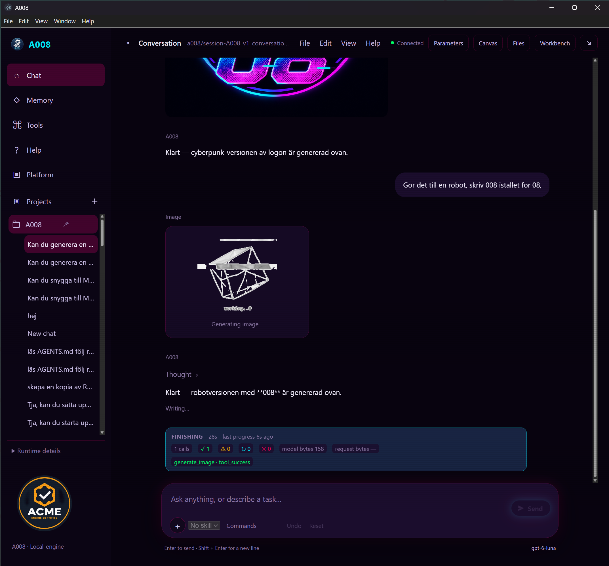</a></td>
    <td align="center"><a href="screenshots/2.png" target="_blank">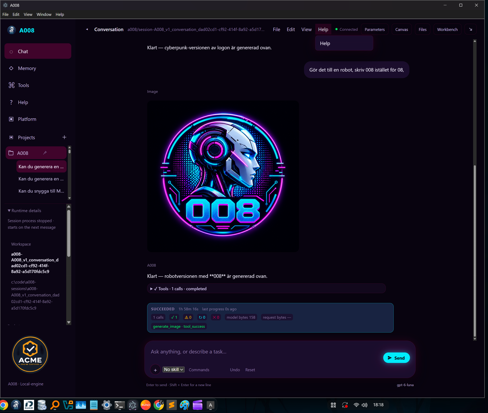</a></td>
    <td align="center"><a href="screenshots/3.png" target="_blank">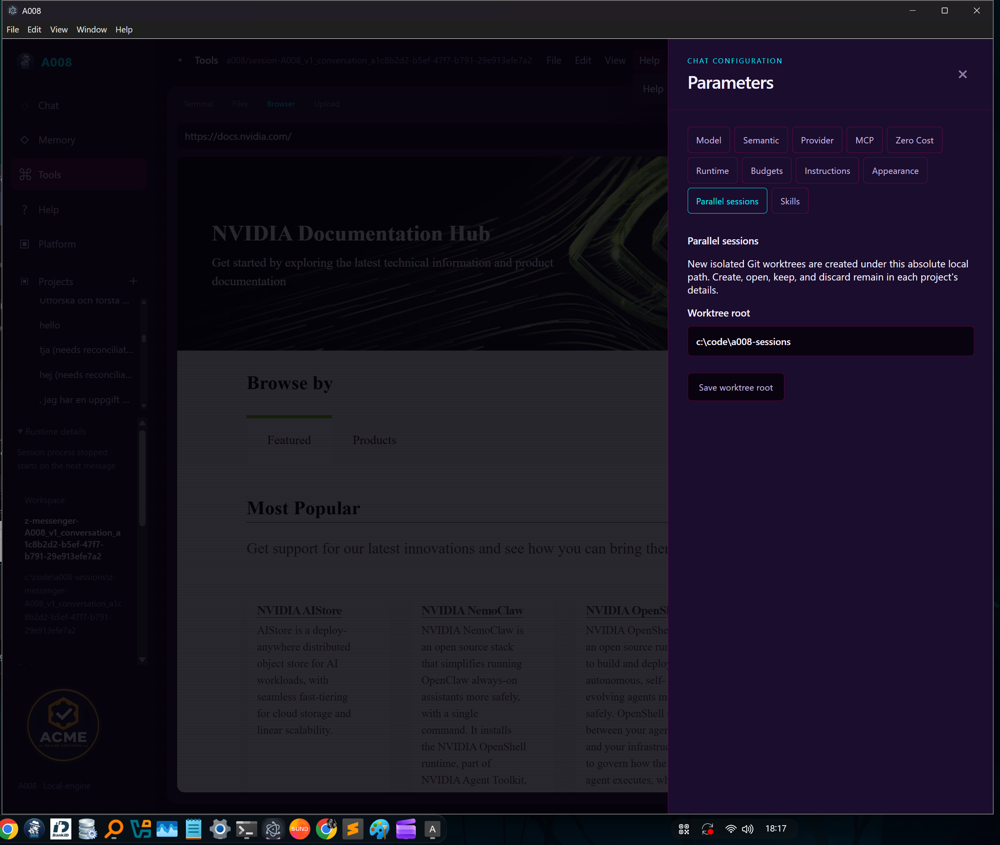</a></td>
    <td align="center"><a href="screenshots/4.png" target="_blank">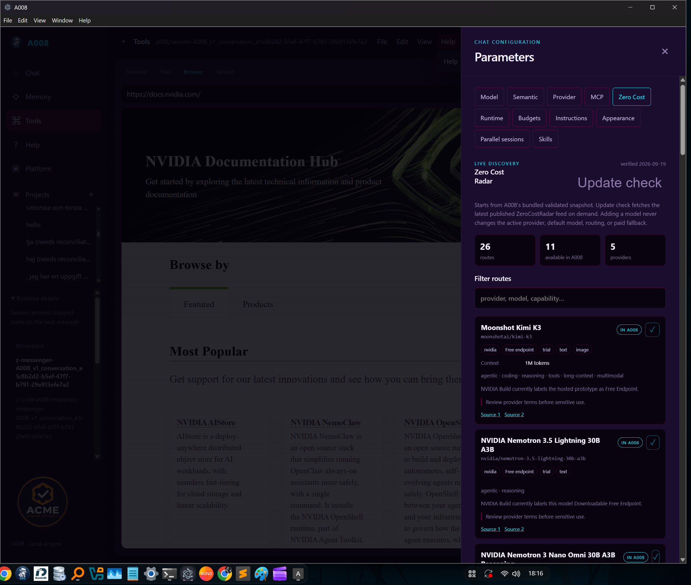</a></td>
    <td align="center"><a href="screenshots/5.png" target="_blank">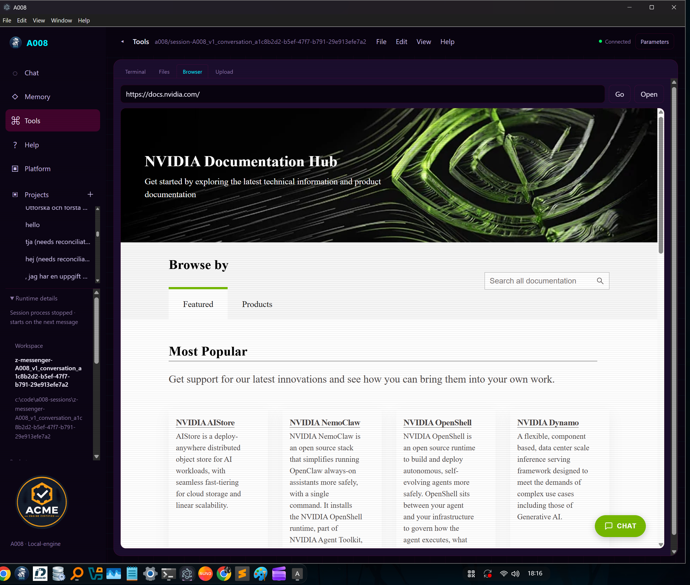</a></td>
    <td align="center"><a href="screenshots/6.png" target="_blank">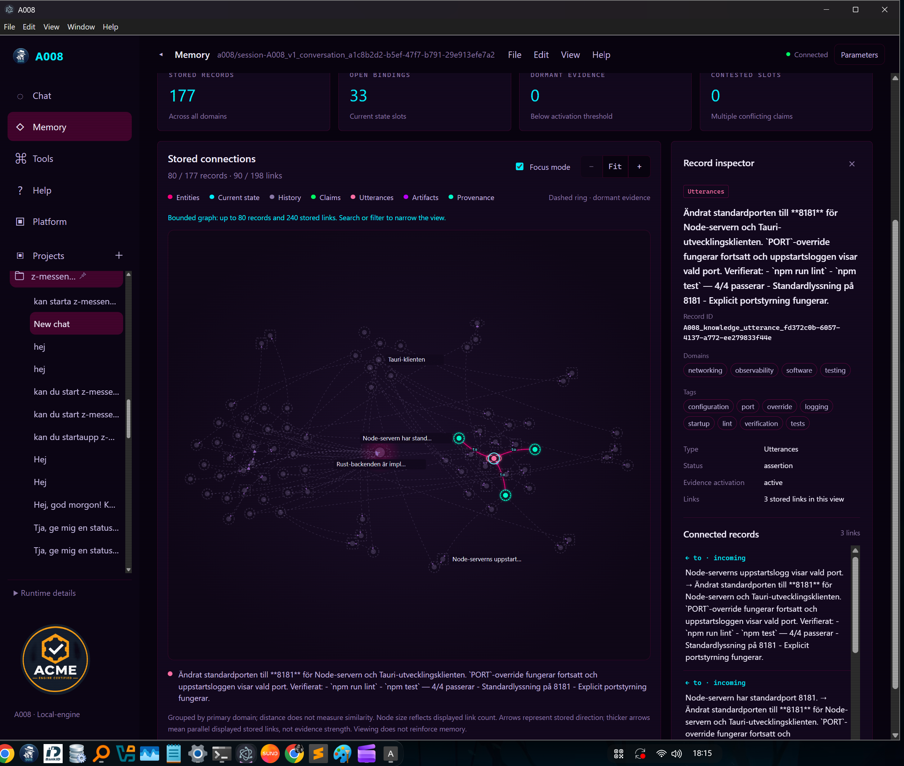</a></td>
  </tr>
  <tr>
    <td align="center"><a href="screenshots/7.png" target="_blank">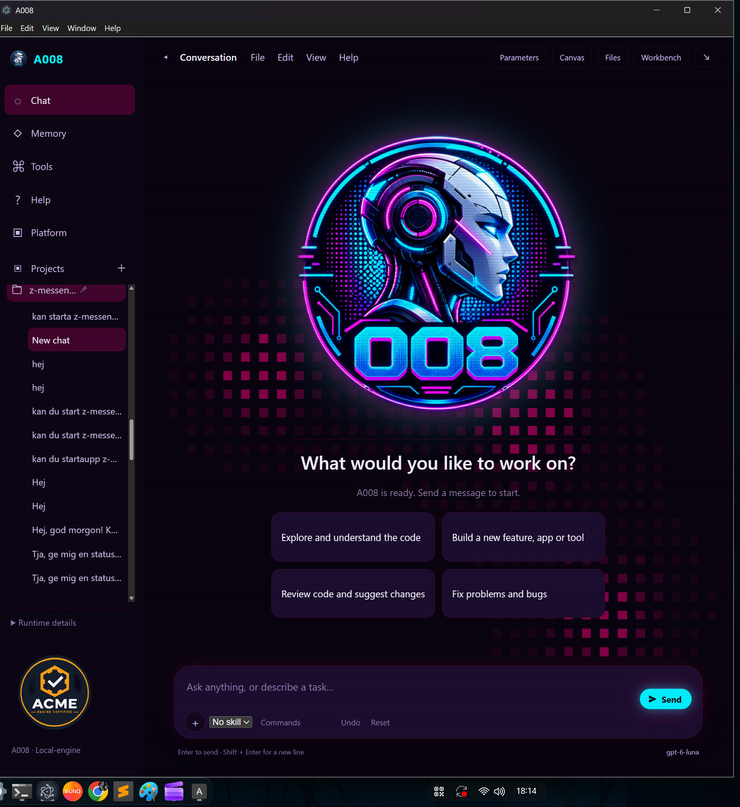</a></td>
    <td align="center"><a href="screenshots/8.png" target="_blank">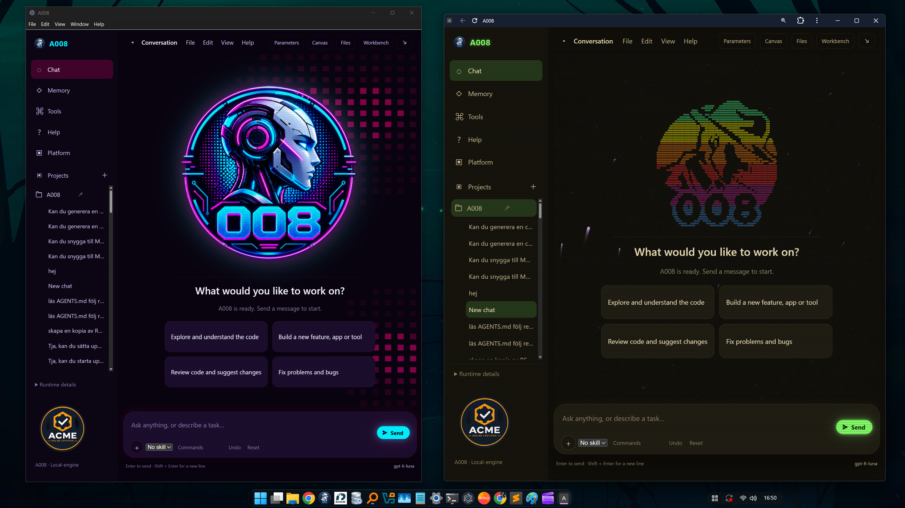</a></td>
    <td align="center"><a href="screenshots/9.png" target="_blank">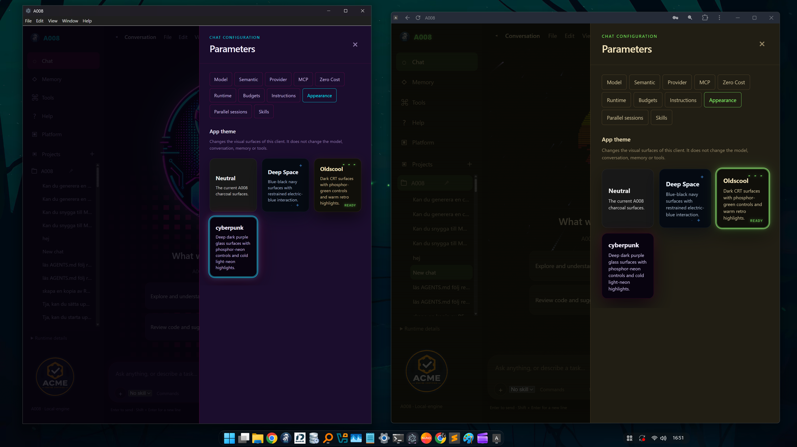</a></td>
    <td align="center"><a href="screenshots/10.png" target="_blank">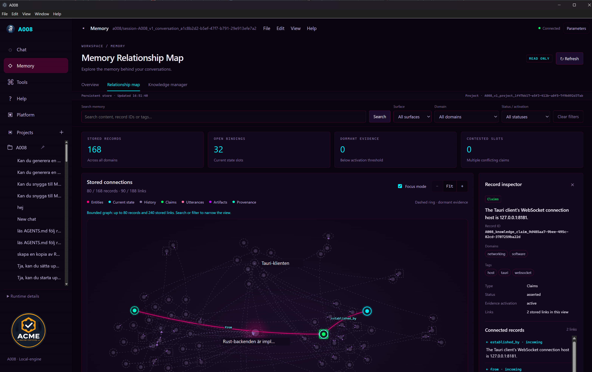</a></td>
    <td align="center"><a href="screenshots/11.png" target="_blank">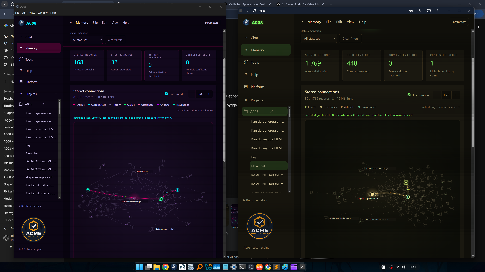</a></td>
    <td align="center"><a href="screenshots/12.png" target="_blank">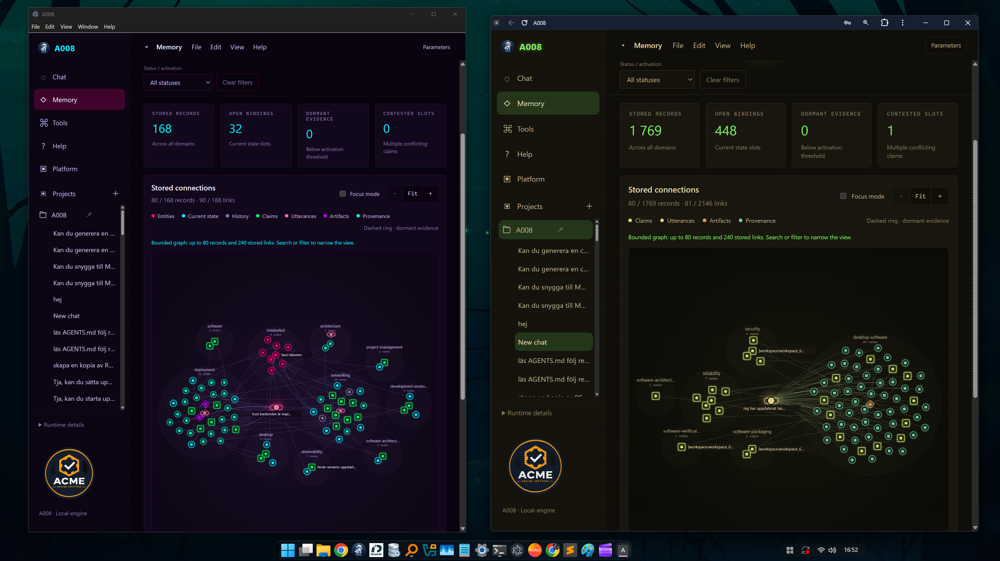</a></td>
  </tr>
</table>
## Implementation status

The status below is based on an inventory of the repository’s code, not on older project documentation.

| Area | Status | Actual implementation |
| --- | --- | --- |
| Shared runtime | Implemented | `ProjectRuntimeRegistry`, `EngineHost`, project-bound sessions, workspace/chat ownership, and portable engine bundle. |
| Projects | Implemented | Create projects, register existing directories, open projects, project registry, saved conversations, and workspace sessions. |
| Chat/sessions | Implemented | Normal standalone GUI uses host-owned durable conversations/runs with isolated worktrees, process-per-session execution, background observation, stored model/parameters, and image attachments. V1/V2/ACP remain compatibility surfaces. |
| Turn Runtime context optimizing | Implemented | During a turn, context will automaticly optimize both regular context and realtime tool runs. See hand-offs: A008-0193, A008-0205, A008-0203|
| Memory view | Implemented | Read-only Overview, Relationship Map/graph, and Knowledge Manager with search, filters, domain/status, and pagination. |
| CLI | Implemented | Interactive chat, `/help`, `/model`, `/status`, `/history`, `/undo`, `/reset`, `/cwd`, `/tools`, `/shell`, and `/exit`. |
| Web GUI | Implemented | A008-owned React/Vite GUI with Chat, Memory, Tools, Help, Projects, Settings, Upload, Files, Terminal, Browser, and Code Canvas. |
| Native desktop | Implemented | Standalone Tauri repo or native desktop client (electron) in this repository. |
| Expo/native proof | Partially implemented | Client-API-program Felixnissens fork A008-Pocket. |
| SDK | Implemented | `packages/client` contains the platform-independent `@a008/client` for V1, V2, and Platform V3 contracts. |
| API | Implemented | V1 host/ACP surface, authenticated V2 HTTP/WebSocket surface, and opt-in V3 durable-work surface. |
| SQLite | Implemented | `better-sqlite3` is used for local semantic memory and, when enabled, Platform V3 conversations/runs/leases/receipts/outbox. |
| SQLite optional | Implemented | Memory uses configured SQLite or in-memory mode; public V3 remains configuration-gated, while normal standalone durable GUI chat can initialize its shared local Platform backend on first access. |
| Background instances | Implemented | The host runs process-per-session workers for durable project sessions; normal GUI submissions and observations use the shared Platform store/coordinator. |
| Themes | Implemented | There is something for everyone. |
| Custom instructions | Implemented | No more "you're a helpful assistant...." |
| Docs-first continuity protocol - Standard or Minimal | Implemented | A repository-native protocol for project continuity, bounded context and resumable work. (minimal saves alot of context)|
| Docs-first-multiagent-orchestrator-addon | Implemented | multiagent-orchestrator-addon (need to know basis context optimizing) |
| ACME-Engine execution | Implemented | Both strict and non-strict deterministic execution npmp integration running on ACME-Engine |

## Workflows and surfaces

### Projects

Projects are host-owned and can be created with optional Git initialization, a Docs-First starter, and a multi-agent policy. An existing absolute directory can be registered without modifying its files. A project can have multiple saved chat conversations and separate workspace sessions.

### Chat

Normal standalone GUI chat uses durable project conversations/runs behind the authenticated `/v1/chat/v3/*` facade and shares the configured Platform store/coordinator with public V3. Each writable conversation has its own Git worktree; accepted runs continue when the browser disconnects. Engine panels and legacy adapter paths retain V1 compatibility. Independent clients can use V2 or Platform V3 as appropriate.

### Memory

The memory view is for diagnostics and reading. It exposes Overview, Relationship Map as stored nodes/associations, and Knowledge Manager with search, filters, status, domain, and detailed inspection. The view is read-only; it is not a visual knowledge-editing tool.

<a href="screenshots/docs-first_minimal-setup-completed.png" target="_blank">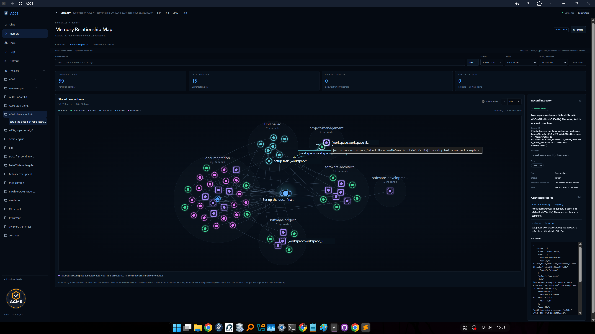</a>

## Agent features and capabilities

| Capability | Status | Details |
| --- | --- | --- |
| Provider/model-independent runtime | Implemented | `ChatTransport`, the model registry, and provider dispatch separate the client from model execution. |
| Text chat | Implemented | NVIDIA Build, kie.ai, and OpenAI have direct transport paths; embedded ACME is the default composition. |
| Thought/content separation | Implemented | Reasoning/thought is streamed separately, and private reasoning data is not written to committed memory. |
| Tool calling | Implemented | Structured tool calls, explicit permission/approval, budgets, and receipts. |
| Repository/file tools | Implemented | Read, create, and edit files, as well as literal Git operations through approved tools. |
| Shell/terminal | Implemented | Host-owned terminal with timeout, output budget, and truncation. |
| MCP | Implemented | Configurable stdio MCP servers, tool integration, and health probing. |
| File upload | Implemented | `POST /v1/upload`, content-addressed blob store, size cap, media sniffing, and text/Markdown/PDF text-layer/DOCX extraction. |
| Image generation | Partially implemented | NVIDIA NIM and kie Market jobs; results are saved as ordered image items in chat. |
| Multimodal input | Partially implemented | Native image attachments are supported for models/transport paths that declare image input. This is not a general multimodal guarantee for all models. |
| Vision-capable | Partially implemented | The registry includes image-compatible models and native image input; capability depends on the selected model/provider. |
| Video/audio/music | Not implemented as a general runtime capability | Unwired native provider endpoints are not treated as though they were supported. |
| Browser | Implemented as a GUI surface | Sandboxed renderer/browser frame checking is available; it does not automatically give the model unrestricted browser tools. |
| Code Canvas | Implemented | HTML artifacts are rendered in a sandboxed, network-denying preview. |

## Clients

### Web GUI

Start with `npm run gui`. The default host is `http://127.0.0.1:8787`. The GUI includes Chat, Memory, Projects, Tools, Settings, Help, Upload, provider/model parameters, themes, workspaces, terminal, files, browser, image viewing, and Code Canvas.

### CLI

powershell
npm run build
node .\dist\src\cli.js models
npm run cli -- chat


The CLI uses the same project- and memory-aware runtime as ACP.

### ACP / Agent Canvas

`A008-acp` is a working ACP-compatible path for Agent Canvas/Agent Server. It is an operator/integration surface, not the primary product GUI.

### Native/desktop/Tauri

There is no Tauri app, native desktop app, or Expo client in this repository. However, a platform-independent SDK and V2 protocol are available for future native/independent clients.

## API and protocol

The V1 host has WebSocket sessions at `/v1/session` as well as routes for memory inspection, upload, projects/workspaces, provider/model, image generation, MCP, shell, and browser.

V2 includes `GET /v2/info`, scoped device grants/revoke, one-use short-lived auth tickets, and `WS /v2/session` with `a008.v2`. Actions are `session/new`, `session/inspect`, `session/prompt`, `session/cancel`, `session/control`, and `tool/permission`. Event sequencing, terminal outcomes, bounded command receipts/idempotency, same-process reconnect/resume, and explicit restart uncertainty are supported. These are process-local guarantees, not durable exactly-once execution or durable sessions after a process restart.

The local Platform backend persists conversations, run receipts, events, workspaces, per-conversation model/generation configuration, session-process identity/activity, and run attachment metadata. Normal standalone GUI chat can open the shared local backend on first access; `A008_PLATFORM_PATH`/host `platformPath` overrides that location. Answer, memory and external-effect outcomes are recorded separately. Public reconciliation remains unavailable.

## Providers and models

The runtime has embedded `acme-engine` as the default execution substrate, direct transport paths for NVIDIA Build, kie.ai, and OpenAI, and an explicit ACME sidecar route. Image generation uses NVIDIA NIM or kie Market. Provider credentials come from the environment or the host’s local secret store and are not sent to the renderer client.

### Zero Cost Radar

Zero Cost Radar is implemented as a GUI/host catalog with a bundled validated snapshot, explicit live updates, and imports only when A008 already has an honest execution path for the route provider. Unsupported routes can be shown as discovery-only; the catalog does not guarantee that every route is free or executable.

## Semantic memory

A008 owns semantic memory; model execution is separate. Memory is project-namespaced and uses SQLite when a persistent store is configured. The live implementation is primarily in `src/memory/` and `src/orchestration/`. The older `SemanticMemory`/`KnowledgeItem` model remains as a v0 compatibility layer, but the local CLI/ACP uses the live knowledge model.

### A008 memory (BASE)

A008: Pre-Provider Call Memory Retrieval  
Mental model: Think of Git with only one branch (main).

Current state = EXACTLY NOW

History = Previous states

A008 Retrieval = Your intelligent librarian

🎭 Scenario: A Visit to the Library

1. User request  
User: “I have a WORKER that needs to work on loadfile.c to change a C function so that it lists only `.md` files and not everything (`*`). It would also be helpful to know whether anyone else has asked about this before.”

2. A008 Retrieval (The Intelligent Librarian)  
A008: “Ah, okay! I’ll put together a briefing folder for you... Let me see what I know about file reading. I’ll retrieve relevant knowledge that is still in the library, sorted by relevance and priority:”

📁 Contents of the Context Envelope (Briefing Folder):

Exact Tags (Latest):  
Tags: Files, fileformat, programming, coding, C files, I/O, Disk Operations

Domain context:  
Everything in the Development domain.

Related knowledge:  
Related information found through fuzzy logic or existing connections.

Current conversation context:  
Since our previous conversation was about Unreal Engine, I also retrieved everything related to Game Engines and Game Development.

Forgotten/Passive Knowledge (Dormant Knowledge Hit):  
“I called the old library and found this dusty, forgotten information: loadfile.c - reading and writing files in C. No one has read it in years, but because it matched your request exactly, I’m including it.”

History and previous versions:

“You’re not the first to ask about this! Along with the latest updated version, I’m including all the previous superseded versions of loadfile.c that we have saved.”

3. Handoff to the Worker  
User: “Hello, my loyal WORKER. I have a CURRENT_TASK for you:  
Help me with this development task: Change loadfile.c so that it lists only `.md` files instead of `*`.  
Read through this briefing folder with all the latest information before you get started.”

4. Execution and result  
Worker: “WOW, this is everything I need and nothing extra! I’m done! Hello, User, I’ve solved the task:  
loadfile.c previously read all file extensions. That is now fixed.  
I needed to include `<stdlib.h>` to make it work.  
Now loadfile.c lists only `.md` files and then reads them.”*

5. Feedback through the Extractor  
Extractor: *Knock knock*

“It’s just me, the Extractor! I’m taking a copy of your result, analyzing it, and sending it back to the A008 librarian for classification and categorization. I need to know whether this changes anything or whether new information has been added.”

6. Archiving and update  
A008 (The Librarian): “At last! I’ve classified and tagged the new knowledge. Who would have thought that the old information about loadfile.c would come in handy again? I’ll make sure it stays in the active library since the topic seems to be getting popular again.”

1. -> Not your standard Retrieval-Augmented Generation (RAG) & context enrichment

Before the developer (“Worker”) receives the task, the librarian (A008) reviews memory and assembles a package (“context envelope”) containing everything that may be relevant:

Exact tags and domains: Relevant knowledge about C programming and I/O.  
Conversation context: What you discussed recently (Unreal Engine).  
Dormant knowledge: Old information that has not been used in a long time, but is “awakened” because it matches exactly.  
History: Previous versions of the code.

2. The Git analogy for memory management

By thinking of memory as a Git branch with only `main`:

Exact now (Current state): The latest known version of the world/code.  
History: Previous states that remain tracked in case you need to roll back or compare.

3. Feedback loop and memory update (the Extractor)

When the Worker has completed the task, that is not the end:

An Extractor analyzes the answer (for example, that `<stdlib.h>` needed to be added).

This new information is sent back to A008 (the Librarian).

The Librarian tags and saves the new knowledge, and makes the old code/knowledge “active” again because it has once again become relevant.

### Flow diagram



```mermaid
flowchart LR

    %% =========================================================
    %% INPUT / EXECUTION LOOP
    %% =========================================================

    Input["User input / observation"]

    Input --> Retrieval
    Retrieval --> Context["Budgeted context projection<br/>required knowledge first"]
    Context --> Model["Model execution"]
    Model --> Output["Final answer"]

    %% =========================================================
    %% SEMANTIC MEMORY
    %% =========================================================

    subgraph Memory["A008 Semantic Memory"]
        direction TB

        Claims["Claims & evidence ledger"]
        Provenance["Provenance / support"]
        State["Current state / HEAD<br/>+ immutable history"]
        Associations["Associations<br/>signed attraction"]
        Lifecycle["Lifecycle / salience<br/>strength · decay · severity<br/>active · dormant · pinned"]

        Claims --> Provenance
        Claims --> State
    end

    %% =========================================================
    %% RETRIEVAL
    %% =========================================================

    subgraph Retrieval["Retrieval Pipeline"]
        direction TB

        Query["Query / task context"]
        Intent{"Intent"}

        Direct["Direct lookup<br/>entity · slot · semantic address"]
        HistoryLookup["History / attribution lookup<br/>state history + provenance"]
        Broad["Broad / associative lookup<br/>lexical · tags · domains · entities<br/>+ association expansion"]

        Filter["Lifecycle + relevance filter"]
        Compose["Compose candidates"]
        Required["Required knowledge first"]
        Budget{"Fits context budget?"}
        Trim["Drop lower-priority<br/>optional candidate"]
        ProjectionError["Explicit projection error<br/>required item cannot fit"]
        Project["Provider-safe projection"]

        Query --> Intent

        Intent -->|"Current state"| Direct
        Intent -->|"History / why / attribution"| HistoryLookup
        Intent -->|"Broad / associative"| Broad

        Direct --> Compose
        HistoryLookup --> Compose
        Broad --> Filter
        Filter --> Compose

        Compose --> Required
        Required --> Budget

        Budget -->|"Yes"| Project
        Budget -->|"No · optional"| Trim
        Trim --> Compose
        Budget -->|"No · required"| ProjectionError
    end

    Input --> Query

    State --> Direct
    State --> HistoryLookup
    Provenance --> HistoryLookup

    Lifecycle --> Filter
    Associations --> Broad
    Claims --> Broad

    Project --> Context

    %% =========================================================
    %% POST-OUTPUT KNOWLEDGE EXTRACTION
    %% =========================================================

    subgraph Intake["Post-output Knowledge Intake"]
        direction TB

        Extraction["Post-output extraction<br/>new knowledge · state updates<br/>relation updates · reinforcements"]

        Classification["Relation classification<br/>new · restatement · extend<br/>supersede · conflict"]

        Validation["Runtime-owned validation<br/>canonical IDs · revision guards<br/>scope · provenance · idempotency"]

        Commit["Atomic commit"]
    end

    Input --> Extraction
    Output --> Extraction
    Context --> Extraction

    Extraction --> Classification
    Classification --> Validation
    Validation --> Commit

    %% =========================================================
    %% CURRENT STATE RESOLUTION
    %% =========================================================

    subgraph Resolution["Current State Resolution"]
        direction TB

        Resolved["Resolved claim"]
        Address["Semantic address"]
        HasHead{"Existing current binding?"}

        First["Create first<br/>current binding"]
        Relation{"Relation to HEAD"}

        Restatement["Keep HEAD<br/>optional reinforcement"]
        Extend["Add compatible knowledge<br/>HEAD remains valid"]
        Supersede["Close previous binding"]
        Conflict["Preserve competing evidence<br/>do not silently replace HEAD"]

        NewHead["Create new open binding"]
        History["Previous binding retained<br/>as immutable history"]

        Current["Current state / HEAD"]

        Resolved --> Address
        Address --> HasHead

        HasHead -->|"No"| First
        First --> Current

        HasHead -->|"Yes"| Relation

        Relation -->|"restatement"| Restatement
        Relation -->|"extend"| Extend
        Relation -->|"supersede / new value"| Supersede
        Relation -->|"conflict"| Conflict

        Restatement --> Current
        Extend --> Current
        Conflict --> Current

        Supersede --> NewHead
        Supersede --> History
        NewHead --> Current
        History --> Current
    end

    Commit --> Claims
    Commit --> Resolved

    Current --> State
    History --> State

    %% =========================================================
    %% MEMORY LIFECYCLE / SALIENCE
    %% =========================================================

    subgraph Salience["Memory Lifecycle / Salience"]
        direction TB

        Active["Active"]
        Dormant["Dormant"]

        Active -->|"decay below threshold"| Dormant
        Dormant -->|"material reuse / reinforcement"| Active
        Active -->|"reinforcement"| Active
        Dormant -->|"no relevant reuse"| Dormant

        SalienceNote["Salience affects retrieval priority only.<br/>It does NOT determine truth,<br/>authority or current state."]

        DormantNote["Dormant knowledge remains reachable<br/>through exact state/entity/slot matches."]

        Active -.-> SalienceNote
        Dormant -.-> DormantNote
    end

    Commit -->|"new evidence / reinforcement"| Active
    Active --> Lifecycle
    Dormant --> Lifecycle
```

```text
input -> retrieval -> budgeted context -> model execution
      -> post-output extraction -> relation classification
      -> runtime-owned commit -> current state/history
```


### Knowledge, state, and provenance

- Claims/evidence, provenance, and current state are separate layers. A resolved semantic address has a current binding; previous bindings are retained as history.
- Current state is retrieved by default. History, attribution, and evidence are retrieved when the task explicitly requires them or when a relevant conflict needs to be shown.
- Truth-bearing attribute and relationship bindings are distinct from association edges, which only assist retrieval.
- The runtime/store owns canonical IDs, revision guards, state reconciliation, and atomic commits. The model may make suggestions, but cannot establish canonical state or identity itself.

### Retrieval and context

Live retrieval follows `DEFINE -> RETRIEVE -> EXPAND -> FILTER -> COMPOSE -> PROJECT`. It uses direct slot/entity matches, lexical matching, tags, domains, and at most one association hop. Exact current-state matches can find dormant knowledge and are not blocked by lifecycle.

Projection is built against an explicit budget for the exactly serialized payload, normally measured in UTF-8 bytes. Required knowledge is included first, and an explicit error is returned if a required item does not fit. Provider context contains only stable knowledge identity, proposition, type, tags, scope, and authority — not scores, lifecycle values, provenance, or audit data. Provider-visible conversation history is limited separately.

### Extraction, classification, and commit

After a successful turn, a strict JSON extractor analyzes the exact retrieved baseline seen by the model, the original message, and the final answer. It can propose `new_knowledge`, `state_updates`, `relation_updates`, and `reinforcements`. Reasoning/thought is not committed to dialogue or memory.

`state_update` is validated fail-closed: it must refer to the same current-state item and semantic address that existed in the turn’s baseline. The relation classifier can classify `new`, `restatement`, `extend`, `supersede`, or `conflict`, but the runtime validates the result and owns the actual reconciliation and commit.

### Lifecycle: strength, decay, and severity

Lifecycle describes retrieval salience, never truth or authority. Evidence carriers have `strength`, exponential decay, a threshold, `active`/`dormant`, `pinned`, and severity. The default policies are:

| Severity | Initial strength | Half-life |
| --- | ---: | ---: |
| `critical` | 1.0 | 365 days |
| `important` | 0.8 | 90 days |
| `minor` | 0.4 | 14 days |
| association | 0.4 | 45 days |

Severity affects the initial lifecycle policy, not truth or which binding is current. Reinforcement occurs only after a completed turn when knowledge has actually been reused or reaffirmed, and at most once per `occurrenceId × evidenceId`. Retrieval itself is read-only and does not reinforce candidates. The older v0 layer instead uses `relevanceScore`, `activationThreshold`, `keepAlive`, and `activationStatus`; those fields do not describe the live model’s general lifecycle.

### Relationships and associations

Associations have their own lifecycle and signed `attraction` (`-1..1`). Positive attraction can increase associative relevance; negative attraction requires an explicit negative signal, and decay moves toward neutrality (`0`). Associations cannot change current state or block exact/direct lookup.

Core live types include `Artifact`, `Entity`, `SlotDefinition`, `AttributeSlotRef`, `RelationSlotRef`, `Utterance`, `Claim`, `ProvenanceRecord`, `SlotClaim`, `Binding`, `StateTransition`, `CorrectionRecord`, `MemoryLifecycle`, and association lifecycle. SQLite schema version 5 stores artifacts, entities, slots, bindings, claims, provenance, lifecycle, receipts, labels, relationships, associations, and FTS, among other data.

`docs/CURRENT_MEMORY_MODEL.md` describes the normative target model. Currently implemented behavior is documented in `docs/SYSTEMDOC.md` and verified by the code.

## GUI features

| Surface | Status |
| --- | --- |
| Chat, thought/answer, image transcript | Implemented |
| Projects, sidebar, saved chats, workspaces | Implemented |
| Memory overview, graph, manager, inspector | Implemented, read-only |
| Context/runtime budgets and instructions | Implemented in runtime preferences/settings |
| Provider/model settings | Implemented; secrets are not exposed in the renderer |
| Themes | Implemented: neutral, deep-space, and oldscool |
| Commands/shortcuts | Implemented in CLI and GUI surfaces |
| Tools/terminal/files/browser/MCP | Implemented with approval/boundaries |
| Upload/source intake | Implemented |
| Memory editing and full graph editing | Not implemented |

## Database and storage

- SQLite via `better-sqlite3` for local memory.
- Separate local workspace store for GUI workspace sessions.
- Content-addressed source/image blob store outside the repository.
- Local user catalog for models, provider/image settings, and MCP configuration.
- Provider secrets in the environment or reviewed local secret store.
- In-memory mode where the project should not use globally persistent memory.

## Docs-First Continuity Protocol

The repository follows the Docs-First Continuity Protocol for task records, current status, handoffs, finished archives, and authority order. Project bootstrap can create Docs-First starter files and a multi-agent policy.

The Docs-First Multi-Agent Orchestrator Add-on is used as an inspected policy/template input for bootstrap. It is not a runtime MCP dependency, and no separate orchestrator service is run by the product runtime.

## Third party and license

A008-owned material is Apache-2.0. Important runtime dependencies include `acme-engine`, `@agentclientprotocol/sdk`, `@modelcontextprotocol/sdk`, `better-sqlite3`, `pdfjs-dist`, `zod`, and `highlight.js`. The complete inventory is in [`docs/THIRD_PARTY.md`](docs/THIRD_PARTY.md); dependencies retain their own terms.

## Install and verify

Requirements: Node.js `>=24.0.0 <25` and npm.

powershell
npm ci
npm --prefix gui ci
npm run typecheck
npm test
npm run verify:protocol
npm --prefix gui run build


Provider credentials are required only for live provider execution. Tests and typechecking should not make live provider calls.

## Repository map

```text
src/                 runtime, providers, memory, ACP, GUI host, tools
gui/                 A008-owned React/Vite GUI
packages/protocol/   shared schemas and protocol contracts
packages/client/     independent HTTP/WebSocket SDK
scripts/              build, package and verification scripts
test/                core, integration and contract tests
docs/                current authority docs and task records
```

See [`docs/CURRENT_STATUS.md`](docs/CURRENT_STATUS.md), [`docs/SYSTEMDOC.md`](docs/SYSTEMDOC.md), [`docs/CURRENT_MEMORY_MODEL.md`](docs/CURRENT_MEMORY_MODEL.md), and [`docs/THIRD_PARTY.md`](docs/THIRD_PARTY.md) for more detail.

## Licens

A008-owned repository contents: Apache License 2.0.
