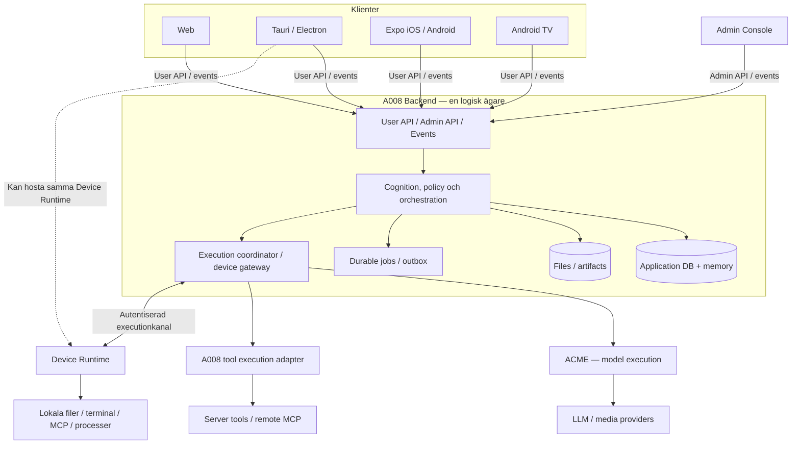

# A008 Platform

Version: 0.9 — komplett förslag för granskning

Datum: 2026-09-22

Dokumentuppgift: A008-0156

Avstämd mot: `77060079ff85635b6b4fe888f01038aedbb4c41a`

## 1. Syfte, status och läsanvisning

A008 ska utvecklas till en sammanhängande plattform där flera projekt och
bakgrundskörningar kan vara aktiva samtidigt. Användaren ska kunna byta vy,
stänga en klient och fortsätta från en annan enhet utan att klientens livscykel
bestämmer arbetets livscykel.

Målbilden är **en canonical A008 Backend, ett separat administrativt Control
Plane, ACME som execution runtime, explicit registrerade lokala execution
targets och flera tunna klienter**. En installation blir en A008-instans med
stabil identitet, gemensamt state och kontrollerad distribuerad exekvering.

Ägaren har valt plattformsriktningen och begärt denna specifikation. Dokumentet
bearbetar ägarens 24-delade utkast och fyller luckor kring parallellitet,
återhämtning, isolation och migration. Det startar ingen implementation.

Följande statusgränser gäller:

- **Beslutad riktning:** plattformsmålet ovan, bibehållen A008-cognition och
  memory, flera klienter och explicit lokal execution.
- **Föreslaget kontrakt:** dokumentets krav med ordet **ska**, krav-ID:n
  `PL-xx`, livscykler och rekommenderade standardval. Dessa är avsedda att
  antas genom avgränsade arkitekturbeslut före berörd implementation.
- **Verifierat nuläge:** endast avsnitt 3 och dess hänvisningar beskriver
  befintligt beteende. Ett krav eller en endpoint här är inte en leveransstatus.
- **Öppna beslut:** avsnitt 26 anger konkreta beslut som återstår före respektive
  leverans. Dokumentet är färdigt som granskningsunderlag; protokollet är inte fryst.

[PROJECT_BRIEF](PROJECT_BRIEF.md), accepterade ADR:er och
[CURRENT_MEMORY_MODEL](CURRENT_MEMORY_MODEL.md) behåller sin nuvarande
auktoritet. Detta förslag ersätter inte tyst deras regler.
[CURRENT_STATUS](CURRENT_STATUS.md) äger leveransstatus och
[SYSTEMDOC](SYSTEMDOC.md) beskriver implementerat beteende.

## 2. Produktutfall och omfattning

Den första produktvinsten är att kunna starta arbete i projekt A, arbeta vidare
i projekt B och återvända till A:s resultat. Två konversationer i samma projekt
ska också kunna arbeta parallellt när deras resurser tillåter det.

Plattformens grundkrav är:

| ID | Krav |
| --- | --- |
| PL-01 | Backend är ensam logisk ägare av accepterat application state; klienter och workers skapar inga alternativa sanningar. |
| PL-02 | Accepterade bakgrundskörningar lever oberoende av vald vy, client connection och klientprocess. |
| PL-03 | Parallella projekt och konversationer isoleras; delade resurser har explicit konflikt- och ägarskapskontroll. |
| PL-04 | Accepterat arbete, resultat och återhämtningsstatus är beständiga och synliga efter backendomstart. |
| PL-05 | Okänd extern effekt får aldrig döljas genom blind återexekvering eller påstådd framgång. |
| PL-06 | Tenant-, resurs- och executionbehörighet verkställs server-side och vid den faktiska executiongränsen. |
| PL-07 | Lokalt arbete kräver en autentiserad target, avgränsad capability och giltig auktorisering. |
| PL-08 | A008:s befintliga knowledge-, state-, memory- och contextsemantik bevaras. |
| PL-09 | Flera klienter kan läsa samma accepterade state, upptäcka konflikter och återansluta utan datagap. |
| PL-10 | User API, Admin API, eventkanal och executionkanal har separata kontrakt och rättigheter. |
| PL-11 | Drift, kvoter, secrets, backup och felsökning har tydliga ägare och verifierbara gränser. |
| PL-12 | Övergången skyddar befintlig data och stödda klienter; ny semantik introduceras uttryckligt. |

Tunna klienter får äga presentation, interaktion, utkast, notifieringar och
lokal cache. De får inte äga egen orchestration, provider-routing eller
memorysemantik. En klient kan fortfarande ha en avancerad UX.

Följande ingår inte i första leveransen: aktiv drift över flera regioner,
automatisk federation mellan A008-instanser, offline-skrivningar med automatisk
konfliktsammanslagning, en publik agentmarknadsplats eller alla klienttyper.
Ingen separat meddelandebroker, graphdatabas eller microservice krävs av
arkitekturen i sig.

## 3. Nuläge och verkliga förändringar

Baslinjen har ett gemensamt A008-runtime, eget GUI/host, lokal SQLite-baserad
memory och konversationspersistens, MCP/tools samt embedded ACME för
modell-exekvering. Det är en bra grund, men inte redan den distribuerade
plattform som beskrivs här.

| Område | Nuvarande gräns | Föreslagen plattformsgräns |
| --- | --- | --- |
| GUI och projekt | Sparade chattar per projekt; standalone-hostens valda workspace är fortfarande globalt | Vald vy per klient; varje kommando och run har egen projektbindning |
| V2-session | En ansluten writer och en aktiv turn per session; disconnect avbryter aktivt arbete | Klienter observerar beständiga runs; disconnect avslutar endast anslutningen |
| Reconnect | 45 sekunders processlokal sessionlease, ingen överlevnad vid processdöd | Beständigt arbete och snapshot/replay; körning återupptas endast när det är säkert |
| Idempotency | Processlokala command receipts med begränsad retention | Beständiga command receipts och separat dispatch-/effektevidens |
| GUI SDK | `@a008/client` finns; bundled chat använder V1-adaptern | Samma uttryckliga plattformskontrakt för fristående klienter |
| ACME | Modell-only execution; A008 äger approval och tool-loop | Samma kognitiva ägarskap; eventuell mekanisk tool-execution i ACME kräver ändrat kontrakt |
| Identitet | Ägarwebbprofil och avgränsade V2-deviceprincipals | Instance/tenant/user/membership och separat execution-deviceidentitet |
| Memory avstängt | Konversationslagret kan vara processlokalt | Durable conversations ska vara oberoende av om semantic memory är aktiverat |

Underlag: [V2-kontraktet](CLIENT_API_V2.md),
[befintlig målarkitektur](A008_SYSTEM_ARCHITECTURE.md),
[ADR 0043](adr/0043-acme-execution-boundary.md),
[ADR 0047](adr/0047-project-sidebar-and-saved-chats.md),
[V2-sessionägaren](../src/gui-host/v2-session.ts) och
[konversationslagret](../src/runtime/conversation-state-store.ts).

Det befintliga [A008-0103-programmet](tasks/A008-0103_stable-client-api-program.md)
har egna frysta steg. Plattformens etapper i avsnitt 25 är en ny föreslagen
leveransordning och ändrar inte programmets status eller återstående uppdrag.

## 4. Topologi och de tre planen



Diagrammet visar en första genomförbar ägargräns med A008:s nuvarande toolägare.
ACME kan efter beslut enligt avsnitt 7 bli transport/exekveringsadapter även
för auktoriserade tool-operationer. Då ändras dispatchvägen, inte vem som
beviljar behörighet, äger tool-loop eller accepterar resultatet.

**Control Plane** består av administrativ backendlogik och Admin Console.
Det administrerar identitet, policies, konfiguration, kvoter och drift.
Admin Console ligger aldrig mellan användarklienten och Backend.

**Core/Data Plane** äger produktens state, auktorisering, memory, run-skapande,
orchestration, projektioner och synkronisering.

**Execution Plane** utför redan auktoriserat arbete via ACME, serververktyg,
MCP och Device Runtime. Provider- och MCP-tjänster är externa beroenden, inte
A008-stateägare.

Planen är logiska gränser. Backend får börja som en modulär process med embedded
ACME, en databas och lokal artifactlagring. En canonical backend kan senare
bestå av flera API- och workerprocesser över samma kontrollerade stateägare.

## 5. Identiteter och domänmodell

| Begrepp | Betydelse och livslängd |
| --- | --- |
| Instance | En installation med stabil `instance_id`, data, policies och administrativa ägare |
| Backend process | En körande process med ny identitet vid restart; inte samma sak som Instance |
| Tenant | En säkerhets- och resursgräns inom instansen; en Organization kan representera den |
| User / principal | User är en människa; principal är en autentiserad människa, tjänst eller device |
| Membership | En users tillhörighet och rättigheter inom en tenant |
| Project | Stabil logisk arbetsyta för conversations, memory, artifacts och runs |
| Workspace binding | Godkänd koppling mellan project och targetens arbetskatalog/repository |
| Conversation | Beständig ordnad arbetsdialog med revision och stabila message-ID:n |
| Runtime session | A008:s execution-/agentcontext med explicit scope, version och checkpointstatus |
| Run | Beständig accepterad arbetsbegäran med auktoritet, tillstånd, budget och resultat |
| Attempt | Ett bestämt försök att utföra ett steg i en run; ny lease/dispatch betyder inte ny Run |
| Tool run | En konkret tool-operation med argument, target, approval och effektevidens |
| Job | Schemaläggningsenhet för en run eller ett efterarbete; ingen alternativ produktägare |
| Device Runtime | Registrerad exekveringsagent på en maskin |
| Execution target | Adresserbar server- eller device-runtime med verifierade capabilities |
| Client connection | Tillfällig nätverksanslutning; flera får observera samma arbete |
| Authentication session | Inloggnings-/credentiallivscykel; ingen synonym för conversation |

```text
Instance
└── Tenant
    ├── Memberships → Users / service principals
    ├── Projects
    │   ├── Conversations → Messages
    │   ├── Runtime sessions → Runs → Attempts / Tool runs
    │   ├── Memory / claims / current-state projections
    │   ├── Files / artifacts
    │   └── Workspace bindings → Execution targets
    ├── Provider / model / MCP configuration
    ├── Devices / grants
    └── Policies / quotas / audit
```

En run hör till exakt en tenant och ett projekt. Den kan ha en conversation
eller vara ett fristående projektjobb. En runtime session korsar inte projekt
eller tenants. En conversation kan behålla sin historik när runtime session
byts. Varje första-versionens runtime session har högst en aktiv run.

En client installation och en execution-deviceidentitet är skilda saker även
när båda finns i samma desktopapp. Dagens V2-devicecredential är inte automatiskt
behörighet att köra en lokal agent.

Projektets ID är inte en filsökväg. Samma projekt kan ha flera uttryckliga
workspace bindings på olika devices eller isolerade worktrees. En worktree
skapar inte automatiskt ett nytt memoryprojekt. Automatisk filsynk mellan
maskiner ingår inte; revision/commit och arbetskopians identitet följer bindningen.

## 6. Stateägande och persistens

Backend accepterar kommandon och äger canonical transitions. Databasen är den
beständiga representationen; frontend får ingen direkt databasåtkomst.
Workers rapporterar observationer och resultat genom ägarkontraktet.

| Logiskt lager | Äger eller lagrar |
| --- | --- |
| Application DB | Identiteter, memberships, projects, conversations/messages, runtime metadata, runs/attempts/tool runs, receipts, approvals, devices, policies och konfigurationsrevisioner |
| A008 Memory Store | Claims, evidence/provenance, semantic addresses, HEAD/history, relationer, lifecycle och härledda index |
| Object storage | Uppladdat och genererat innehåll, bilder, dokument, stora tool-output och exporter |
| Durable jobs / outbox | Beständigt schemaläggnings- och leveransunderlag knutet till accepterat state |
| Cache / eventtransport | Härledda vyer och leverans; får återskapas utan att bli alternativ sanning |

Databasvalet är separat från det semantiska kontraktet. SQLite får behållas för
avgränsad lokal drift. PostgreSQL är en föreslagen kandidat för flerprocessdrift,
inte ett krav att byta all memorylagring i första etappen.

**PL-04:** Ett accepterat command, dess receipt, användarmeddelande, run och
outboxpost skrivs atomärt inom sin application-stategräns innan klienten får
bekräftelse. `202 Accepted` betyder beständigt mottaget, inte slutfört.
En worker får aldrig starta från enbart en optimistisk klientpost.

Om memory eller objekt ligger i andra fysiska lager används beständiga,
idempotenta efterarbeten med explicit status. En distribuerad atomär transaktion
mellan alla lager förutsätts inte. Artifactbytes skrivs först till staging;
metadata publiceras efter verifierad lagring. Avbrutna uppladdningar städas
genom en dokumenterad retentionregel.

Conversation persistence är en produktfunktion även när semantic memory är av.
Den förändringen kräver separat migration och beslut eftersom nuläget kopplar
lagrets livslängd till memoryläget. Resonemangsströmmar blir inte persistent
conversation, checkpoint, receipt, eventreplay eller memory.

## 7. Gränsen mellan A008 och ACME

**A008 bestämmer vad, varför, när och med vilken auktoritet. ACME genomför
den tillåtna modell-exekveringen.**

A008 äger modellval, providerpolicy, instruktioner, context build, agentplan,
toolval, approvals, tool-loop, tenantbehörighet och tolkningen av resultat.
ACME får äga providertransport, normalisering, streaming, timeout,
cancellationmekanik och verifierbar executionevidens.

A008:s Run och ToolRun är canonical produktstate. ACME:s execution-ID och
attemptstatus är underliggande evidens som A008 översätter; de ersätter inte
Run, message-ID eller A008:s eventordning.

Ägarens utkast önskar också ACME-exekverade tools och MCP. Det går längre än
[ADR 0043](adr/0043-acme-execution-boundary.md), som uttryckligen förbjuder
ACME att exekvera A008-tools. Föreslagen hantering:

1. Första plattformsbeviset behåller befintlig A008-toolägare och embedded ACME.
2. Om tools flyttas till ACME antas först ett avgränsat ADR-tillägg och ett
   verifierat tool-executionkontrakt. Varken nuvarande paket eller en
   arkitekturbild räcker som bevis på stöd.
3. Tillägget får endast delegera mekanisk exekvering av konkreta auktoriserade
   operationer. Cognition, approval, behörighet och fortsättningsbeslut stannar i A008.

En run specification innehåller scope, vald modell, contextreferenser,
konfigurationsrevision, budget, tillåtna tooldefinitioner och targetbegränsningar.
Den är inte ett generellt godkännande av alla framtida argument.

Varje effektfull tool dispatch binds till `run_id`, `tool_run_id`,
principal/tenant/project, target/workspace, verktygsversion, argumentdigest,
approval/grant, policyrevision, deadline och dispatchidentitet. A008 kontrollerar
aktuell auktoritet före dispatch; executionadaptern kontrollerar uppdragets
integritet och sina lokala begränsningar.

Retry har en ägare per nivå: A008 för produktsteg, ACME för tillåtna
transportförsök, device för kvittering av samma dispatch. Ingen nivå får
multiplicera retries, kostnad eller sidoeffekter genom att anta att nästa nivå
inte redan har försökt. Automatisk providerfallback efter ett oklart dispatch
är inte tillåten.

## 8. Parallella projekt och bakgrundsarbete

**PL-02:** Att navigera, välja en annan chatt, stänga fönstret eller tappa
WebSocket ska endast ändra observationen. Backend fortsätter en accepterad
bakgrundsrun inom dess ursprungliga auktoritet, budget och deadline.

Bakgrund betyder inte obegränsad autonomi. Om nästa steg kräver nytt godkännande
går run till vänteläge. Utloggning stänger klientens åtkomst men behöver inte
stoppa redan accepterat arbete. Återkallad run-/principalbehörighet ska däremot
fence:a nya steg och begära stopp enligt avsnitt 16. UI ska skilja
**Koppla från**, **Avbryt körning** och **Återkalla åtkomst**.

| Samtidighet | Föreslagen standard |
| --- | --- |
| Olika projekt | Får köra samtidigt inom kapacitets- och tenantgränser |
| Olika conversations i samma projekt | Får köra samtidigt; separata runtime contexts, approvals och streams |
| Samma conversation | Högst en icke-terminal run som kan skriva svaret; nytt konkurrerande promptkommando avvisas med konflikt |
| Två klienter på samma conversation | Båda får observera och skicka auktoriserade kommandon; serverrevision och run-lås avgör vad som accepteras |
| Samma skrivbara workspace | Exklusiv skrivlease eller separata worktrees; ingen automatisk samtidig filmutation |
| Samma memoryadress | En serialiserad/revisionskontrollerad state transition; inga konkurrerande HEAD |

Det första kontraktet avvisar en andra prompt medan conversation är upptagen.
Klienten behåller utkastet. Köade följdprompts kan senare införas med uttrycklig
context-/revisionsemantik; systemet ska inte tyst köra en gammal prompt mot en
ny, orelaterad historik. Parallella alternativa svar kräver en separat
conversation/fork med spårad förälder.

Varje run binder projekt, conversation revision, workspace, modellpolicy och
contextversion. Context byggs av backend för den accepterade turen och binds
före första dispatch. Byte av vald vy eller global inställning får inte
retroaktivt ändra detta. Behörighet omprövas ändå inför nya effekter.

En scheduler tillämpar begränsningar per tenant, principal, projekt, provider
och target. Den redovisar köorsak och ger flera projekt möjlighet att göra
framsteg. En stor run får inte ensam blockera all interaktiv kapacitet.
Första implementationen kan använda en enkel beständig kö med uttryckliga
konkurrensgränser; avancerad prioritering är inget förhandskrav.

Agentdelegation skapar spårade child runs med `parent_run_id`, egen scope och
delbudget. Ett barn får inte utöka rättigheter eller spendera utanför
förälderns budget. Avbrytning av en trädstruktur måste ange vilka barn som
stoppats och vilka effekter som redan genomförts.

## 9. Run-livscykel och cancellation

Föreslagna tillstånd:

| Tillstånd | Betydelse och tillåten fortsättning |
| --- | --- |
| `queued` | Beständigt accepterad; väntar på kapacitet, får starta eller avbrytas |
| `running` | Aktuell worker äger lease; får utföra auktoriserade steg |
| `waiting_approval` | Kräver aktuellt godkännande; fortsätter endast efter giltig resolution |
| `waiting_target` | Godkänd target otillgänglig; får vänta till deadline, inte tyst byta maskin |
| `cancel_requested` | Nya steg stoppas; pågående execution håller på att kvitteras/avslutas |
| `needs_reconciliation` | Extern effekt eller completion är okänd; ingen automatisk retry eller fortsatt effektfull execution |
| `succeeded` | Avtalat huvudresultat har committats |
| `failed` | Arbetet avslutas utan uppnått huvudresultat; felorsak och eventuell olöst extern effekt redovisas separat |
| `cancelled` | Ingen fortsatt execution finns under aktuell auktoritet; kända redan utförda effekter redovisas |

De tre sista är terminala. `needs_reconciliation` är ett blockerat,
icke-terminalt tillstånd som behåller konfliktspärren för berörd conversation
och workspaceeffekt. Observation/reconciliation får köras där; nya effekter
kräver ny giltig auktorisering.

Terminal transition sker högst en gång genom revisionskontroll. Om cancel och
completion tävlar vinner den transition som accepterats av backend.
En cancellationbegäran som kommer efter completion returnerar redan uppnått
terminalt state. Cancellation gör aldrig tidigare sidoeffekter ogjorda.

Approval är beständigt, engångsbaserat och bundet till operation, argument,
target, behörig beslutsfattare och expiry. Flera klienter får visa det, men
bara en giltig resolution får vinna. En ändrad operation kräver ny approval.
Väntan har deadline; uteblivet svar beviljar aldrig operationen.

Återhämtning från `needs_reconciliation` kräver observerad evidens om tidigare
utfall eller en uttrycklig operatörsresolution som dokumenterar osäkerheten.
Det får inte fabricera bevis på att en extern effekt uteblivit. Ett eventuellt
nytt försök är separat spårat och kräver att dupliceringsrisken hanteras.

Om evidens inte går att återfå får en behörig operatör avsluta orchestrationen
som `failed` med `failure_kind=unresolved_external_effect` och bibehållet
`effect_status=unknown`. Det frigör conversation för nytt, uttryckligt arbete
men innebär varken cancellationbevis eller att samma effekt får upprepas.
Berörd target/workspace hålls spärrad för kolliderande dispatches tills dess
executionstatus har kontrollerats eller en separat auditerad riskresolution
har fattats. Run-status och faktisk extern effekt får inte sammanblandas.

Huvudresultat, effektevidens och efterarbete redovisas separat: exempelvis
`answer_status=completed`, `memory_status=failed`. En memoryretry får inte
återgenerera svaret. Ett känt fel kan ha kända partiella effekter; `failed`
betyder inte rollback.

## 10. Återhämtning, idempotency och arbetsägarskap

En run ägs inte av en workerprocess. Workers får tidsbegränsade leases.
Varje ny lease har en högre generation, ett så kallat fencingvärde. En gammal
worker får efter leaseförlust inte committa state eller skapa nya dispatches.
Återstart kräver att den beständiga ägaren kan fastställa vem som får fortsätta.

Detta hindrar dubbla canonical writes. Det gör inte en redan skickad extern
operation ogjord. En förlorad worker kan ha hunnit skriva en fil eller skicka
ett provideranrop före nätverksfelet; därför behövs effektevidens och osäkerhetsläge.

| Händelse | Krävt beteende |
| --- | --- |
| Klientens svar försvinner efter accept | Slå upp samma command receipt; skapa ingen ny run |
| Worker dör före dispatch | Ny lease får fortsätta från verifierat ej skickat steg |
| Worker dör efter dispatch, före resultatcommit | Fråga adapter/target om evidens; annars `needs_reconciliation` |
| Resultat committat men event ej levererat | Outbox levererar igen; klient deduplicerar |
| Samma devicekommando anländer två gånger | Samma dispatchidentitet ger befintligt resultat eller explicit osäkerhet |
| Gammal worker återkommer | Avvisa sena writes/nya dispatches med gammal generation |
| Target försvinner under tool-execution | Rapportera okänt utfall tills verifierat; timeout bevisar inte utebliven effekt |

Mutationsidentitet scope: `(tenant_id, principal_id, command_id)`, med digest
av canonical operation och resursreferenser. Samma ID och payload returnerar
samma receipt; ändrad payload ger konflikt. Request-ID identifierar endast ett
nätverksförsök. Run-ID och tool dispatch-ID är separata.

Receipts och dedupegränser överlever restart och har annonserad retention.
Aktiva eller oklara operationer får inte glömmas för att släppa in fler.
Efter retention eller okänd receipt ska klienten slå upp befintliga resurser
och visa osäkerhet; den får inte automatiskt skicka samma arbete med nytt ID.

Eventleverans och jobs kan ske mer än en gång. Konsumenter ska vara idempotenta.
Systemet utlovar **en accepterad canonical transition**, inte generellt
exactly-once för provider-, MCP-, terminal- eller fileffekter.

Checkpointformat tillhör A008-runtime/adaptern och är versionsbundet. Det
sparar tillåtet executionunderlag, aldrig rå reasoning. Plattformen utlovar
återhämtning till ett korrekt observerbart tillstånd; sömlös fortsättning mitt
i ett provideranrop kräver uttryckligt adapterstöd.

## 11. Memory, current state och context

**PL-08:** [CURRENT_MEMORY_MODEL](CURRENT_MEMORY_MODEL.md) är fortsatt den
semantiska auktoriteten. Plattformen ändrar lagring, transport och isolation,
inte vad en claim, HEAD, history, support, salience eller reinforcement betyder.

Särskilt gäller:

- Claims och provenance bevaras; current state är en projektion med högst en
  HEAD per löst semantic address.
- Strength, decay, dormancy och retrievalscore får inte bestämma truth.
  Exact current-state lookup får inte blockeras av dormancy.
- En occurrence får förstärka samma knowledge högst en gång även vid jobretry.
  Candidate discovery är inte reinforcement.
- Retrieval, context build, reconciliation och acceptance ägs av A008.
  Vektor-/graphlagring och ACME får inte ta över dessa beslut.
- Reasoning blir inte durable knowledge eller en dold del av context.

Security scope läggs runt modellen: tenant, project, behörigt memoryscope och
principalpolicy. Behörighetsfiltrering sker före utlämning av kandidater,
snippets, graphgrannar, counts och context. Cachear måste ha samma scope.
Domain/tag/current scope är semantiska signaler, aldrig accesskontroll.

Två conversations i samma projekt får dela godkänd project-memory men har egna
conversation contexts. Delning mellan projekt eller tenants sker endast genom
en uttryckligt tillåten import/delning med proveniens; ett gemensamt index är
ingen tillåtelse att blanda context.

Samtidig extraction kan skapa förslag parallellt. Accept/HEAD-transition måste
ske under samma projekts memoryägare med revisionskontroll och reconciliation.
Senaste nätverkssvar eller senast startad worker avgör inte semantisk sanning.
Gamla förslag omprövas mot aktuellt state; de skriver inte över det blint.

Memoryjobb binder till committed originalmessage/final answer och occurrence-ID.
Deras pending/failed/complete-status går att inspektera separat från svaret.
Återhämtning deduplicerar knowledgeeffekter och behöver inte upprepa
modellgenereringen av det redan accepterade chattsvaret.

## 12. Identity, tenants och authorization

Första datamodellen ska bära tenant och principal även i single-user-läge.
Den lokala installationen kan ha en förskapad tenant och ägare. Det förenklar
senare delning utan att införa oskopade rader som måste tolkas i efterhand.

För remote/multi-user rekommenderas standardbaserad OIDC-inloggning med en
separat identitetsleverantör. Val av leverantör och registreringsmodell är öppet.
OAuth-baserade native clients bör använda authorization code med PKCE enligt
[OAuth Security BCP](https://datatracker.ietf.org/doc/html/rfc9700).
Detta är en rekommendation för kommande profil, inte ett påstående om dagens PIN.

Backend verifierar identitet, medlemskap och resursrättigheter vid varje
operation. Tenant-ID i en URL, tokenclaim eller requestbody beviljar inte i sig
åtkomst. Relationer och joins måste bevara tenantgränsen, även i jobs,
filåtkomst, events, sök, exports och audit.

Föreslagen rättighetsmodell kombinerar roller med resurs- och actionscope:

| Scope | Exempel |
| --- | --- |
| Instance administration | Tenantlivscykel, drift och globala begränsningar |
| Tenant administration | Medlemskap, policies, delade provider-/MCP-inställningar |
| Project access | Läsa, skriva, starta runs, dela och administrera projekt |
| Conversation / memory / files | Läsa, ändra, exportera, arkivera enligt respektive kontrakt |
| Execution | Använda viss target/capability, godkänna operation, avbryta run |
| Secrets | Skapa/rotera/referera en hemlighet utan generell rätt att läsa dess klartext |

Administrativ driftåtkomst ger inte automatiskt läsrätt till privata prompts,
memory eller filer. Eventuell särskild supportåtkomst kräver separat
behörighet, tidsgräns och audit. Modell- eller toolproducerad text får aldrig
skapa en ny behörighet.

Ett background run-grant är separat från klientens kortlivade login/token.
Det binds till principal, project, ändamål, budget, expiry och policy. Utgången
client credential hindrar nya klientanrop men återkallar inte automatiskt en
fortfarande giltig run-grant. Återkallat medlemskap eller executiongrant gör det.

## 13. Device Runtime och execution targets

Device Runtime får vara inbyggd i Tauri/Electron eller en separat headless
agent. Den registreras, binds till tenant/ägare och får en egen återkallningsbar
maskinidentitet. En första version bör binda en runtimeinstans till en tenant;
delad maskin mellan tenants kräver separat executionisolation.

Device Runtime initierar normalt en utgående autentiserad TLS-kanal till A008:s
device gateway. Detta möjliggör arbete bakom NAT utan att öppna ett allmänt
inkommande shell. Kanalprotokoll, enrollment, credentialrotation och
versionsförhandling fryses separat från User API.

Ett praktiskt livscykelkontrakt omfattar:

1. Enrollment godkänns av behörig ägare med kortlivad engångsregistrering.
2. Runtime publicerar version, capabilityinventering och tillgänglighet.
3. Backend binder godkända workspace-/toolgrants, deadlines och begränsningar.
4. Runtime tar emot konkreta dispatches, validerar scope och deduplicerar.
5. Heartbeats och progress rapporteras; resultat/effektevidens kvitteras och
   återlevereras efter reconnect inom annonserade gränser.
6. Revoke eller expiry stoppar nya operationer och initierar cancellation.

En capabilitydeklaration beskriver teknik, inte tillstånd att använda den.
Klientcapabilities som notifications, kamera eller filväljare hålls separata
från privilegierade executioncapabilities.

Illustrativt inventeringsobjekt, inte fryst wire-schema:

```json
{
  "device_id": "device-example",
  "runtime_version": "1",
  "capabilities": [
    {
      "name": "filesystem",
      "version": "1",
      "operations": ["read", "write"],
      "workspace_binding_ids": ["workspace-example"]
    },
    {
      "name": "terminal",
      "version": "1",
      "workspace_binding_ids": ["workspace-example"]
    }
  ]
}
```

Execution kräver samtidigt giltig deviceidentitet, kompatibel capability,
godkänd workspacebindning, tenant-/userpolicy, run-grant och aktuell
operation/approval. Backend kontrollerar den centrala rätten; device kontrollerar
också lokala gränser och får alltid neka.

Filoperationer validerar den upplösta sökvägen inom tillåtna roots, inklusive
symlinks/junctions och plattformens pathregler. En terminal med värdprocessens
rättigheter är en starkare capability än ett avgränsat fil-API; katalogbindning
ensam sandboxar inte shellkod. Den måste få en uttrycklig executionprofil med
OS-isolation eller dokumenterat värdförtroende. UI och audit visar skillnaden.

Targetval är explicit. Mobilen kan starta arbete på en registrerad desktop
utan att själv kunna köra terminalen. En offline PC ersätts inte automatiskt
med servern eller en annan maskin. Eventuella targetgrupper måste i förväg
definiera kompatibelt workspace, credentials och tillåtna effekter.

Förlorad kanal ger ingen ny offlineauktoritet. Nya dispatches kräver färsk
auktorisering. Redan startat arbete begränsas av sin lokala lease/deadline.
Backend kan inte lova omedelbart stopp på en frånkopplad maskin; fram till
kvittering visas `cancel_requested` eller `needs_reconciliation`.

Att stänga desktopfönstret lämnar backendarbete aktivt. Devicearbete kan
fortsätta bara om Device Runtime också fortsätter som tjänst/bakgrundsprocess.
Om appavslut stänger runtime ska användaren se vilken target som försvinner.

## 14. API-kontrakt och versionsstrategi

**PL-10:** Fyra ytor hålls isär:

| Yta | Ansvar |
| --- | --- |
| User API | Projects, conversations, memory, files, runs och användarens kontroller |
| Admin API | Policy, konfiguration, identitetsadministration, drift och audit |
| Realtime | Auktoriserade ändringar, runprogress och återanslutning |
| Execution/device channel | Registrering, dispatch, lease, cancellation och effektevidens |

Dagens V2 använder `WS /v2/session`, subprotocol `a008.v2` och redan definierade
session-/disconnectregler. De får inte ändras i smyg till background run-semantik.
Nya kompatibla operationer kan förhandlas som nya capabilities; oförenliga
betydelser kräver ett nytt versions-/protokollkontrakt. `/v2/events` är här ett
förslag, inte en befintlig route eller ett beslut att återanvända versionsnumret.

Följande resourceyta visar avsikten. `/platform-api` är en platshållare tills
versionsbeslutet fattats:

```http
GET    /platform-api/me
GET    /platform-api/projects
POST   /platform-api/projects
GET    /platform-api/projects/{projectId}
GET    /platform-api/projects/{projectId}/conversations
POST   /platform-api/projects/{projectId}/conversations
GET    /platform-api/conversations/{conversationId}
POST   /platform-api/conversations/{conversationId}/messages
POST   /platform-api/runtime-sessions
GET    /platform-api/runtime-sessions/{runtimeSessionId}
POST   /platform-api/runs
GET    /platform-api/runs/{runId}
POST   /platform-api/runs/{runId}/cancel
GET    /platform-api/commands/{commandId}
POST   /platform-api/approvals/{approvalId}/resolve
GET    /platform-api/projects/{projectId}/memory
GET    /platform-api/projects/{projectId}/memory/graph
GET    /platform-api/projects/{projectId}/files
POST   /platform-api/projects/{projectId}/files
GET    /platform-api/artifacts/{artifactId}
GET    /platform-api/models
GET    /platform-api/providers
GET    /platform-api/mcp
GET    /platform-api/devices
WS     /platform-api/events
```

Meddelandekommandot anger om det ska skapa en run; standard för skickad
chatprompt är ett atomärt message+run-kommando. Klienten får då tillbaka
`command_id`, `message_id`, `run_id` och accepterad revision och ska inte
därefter skapa samma run via det separata run-API:t. Fristående jobs använder
`POST /runs` med eget avgränsat inputkontrakt.

API:t ska ha schema, stabila felkoder, cursorpagination, payload-/uploadgränser,
idempotency och resursrevisioner. Listor, detaljer och artifacts auktoriseras
var för sig. Provider/MCP-läsning för användare lämnar endast tillåtna metadata,
inte administrationskonfiguration eller secrets.

Villkorliga mutationer föreslås använda stark `ETag`/`If-Match`; misslyckad
precondition ger `412`. Konkurrerande aktiv run eller ändrad commandpayload
ger separat konflikt. Detta bygger på
[HTTP Semantics §13.1.1](https://www.rfc-editor.org/rfc/rfc9110.html#section-13.1.1).
Ett första accepterat message+run kontrollerar conversationrevisionen atomärt.

Nya HTTP-fel kan använda
[Problem Details](https://www.rfc-editor.org/rfc/rfc9457.html) med A008-felkod,
correlation-ID och explicita recoveryalternativ. Det ändrar inte befintliga
V2-felobjekt. Ett generellt `retryable=true` tillåter aldrig automatisk
återsändning av en mutation med okänt utfall.

SDK:t delar transport, scheman, authadaptrar och reconnectlogik.
Det innehåller ingen klientägd run-scheduler eller memorymotor. En
kontraktstestklient utan interna hostimports ska kunna genomföra hela grundflödet.

## 15. Events och synkronisering

Durable events beskriver redan accepterade stateförändringar. De innehåller
`event_id`, schema-version, resurstyp/ID, resource revision, timestamp,
correlation/causation och relevant run-ID. Tenant och authorization kontrolleras
server-side innan leverans; klientfiltrering ersätter inte denna kontroll.

Ordning garanteras där den behövs: per conversation/run eller annan aggregate.
En global totalordning mellan alla tenants krävs inte. Resume cursor är opak,
scopebunden och kan inte användas för att läsa otillåtna event.

**PL-09:** Snapshot och prenumeration måste fånga samma watermark utan gap.
Backend upprättar en konsistent snapshot/replaygräns, skickar snapshot och
därefter endast nyare event. Klienten deduplicerar event-ID:n/revisioner,
upptäcker luckor och hämtar authoritative state när den inte kan fortsätta säkert.

```mermaid
sequenceDiagram
    participant A as Klient A
    participant B as Klient B
    participant BE as A008 Backend
    participant W as Worker / ACME / target
    A->>BE: Message + run, command-ID, expected revision
    BE->>BE: Commit message, run, receipt, outbox
    BE-->>A: Accepted + run-ID
    BE-->>B: Run queued, ny revision
    BE->>W: Auktoriserad dispatch
    Note over A,BE: A kopplar från; run fortsätter
    W-->>BE: Resultat och executionevidens
    BE->>BE: Commit resultat och event
    BE-->>B: Run slutförd
    A->>BE: Återanslut med cursor
    BE-->>A: Replay eller snapshot + watermark
```

Eventhistorik har annonserad retention. Utgången cursor ger uttryckligt
resyncbehov; full state refresh ska alltid vara möjlig inom användarens
aktuella behörighet. Långsamma konsumenter har begränsad buffer och får
resynkinstruktion, inte obegränsad minneskö i backend.

Durable events och tillfälliga deltas är olika kontrakt. Token-/progressdeltas
får tappas under reconnect om det framgår; färdiga messages/run-state ska
återfås från canonical API. Reasoning är transient och ingår inte i replay.
Eventpersistens kräver ingen full event-sourced implementation.

En återkallad prenumeration stängs, och inga nya otillåtna event skickas.
Återanslutning kontrollerar ny behörighet även om cursorn tidigare var giltig.
Reconnect är aldrig ett kommando att återskapa ett svar.

## 16. Säkerhet, secrets och trust boundaries

**PL-06/07:** Backend är central enforcement point. Device Runtime och andra
executionadaptrar måste dessutom verkställa sina lokala grants. Varken
clientdeklaration, modelltext, uppladdad fil eller MCP-output är produktpolicy.

Varje gräns ska ha requestvalidering, storleksgränser, autentisering,
resursauktorisering och audit. Browserprofilen behöver dokumenterad cookie-,
CSRF- och Originpolicy. WebSocket autentiseras med en avgränsad mekanism utan
långlivade secrets i URL:er. Externa anslutningar skyddas med TLS.

Server-side MCP, URL-intake och nätverkstools måste få en uttrycklig
egress-/destinationspolicy så att en tillåten användaroperation inte blir
obegränsad åtkomst till interna tjänster. Data som skickas till provider, MCP
eller device begränsas till operationens godkända scope.

Secrets delas upp i:

| Ägare | Placering och användning |
| --- | --- |
| Platform / tenant | Backendens secret provider; krypterat material eller säker extern referens |
| User | Användarskopad secret owner; rätt till användning skiljs från klartextläsning |
| Device-local | OS secure storage eller lokalt godkänd secret provider; lämnar normalt inte maskinen |
| Ephemeral execution | Kortlivad credential med avgränsad audience, operation och expiry |

Vanliga klienter får secret-ID, status och tillåtna metadata. Providerkeys
och MCP-credentials lämnas inte tillbaka som konfigurationsfält.
Rotationsnycklar för kryptering hålls skilda från krypterad databackup.
En serverworker får inte anta att den kan använda en device-local credential.

Revoke ska atomärt blockera nya accepterade operationer och ogiltigförklara
beroende grants enligt sin scope. Aktiva dispatches stoppas vid nästa
enforcementpunkt och cancellation skickas till deras ägare. Det finns ett
oundvikligt fönster för redan skickade externa operationer; status får inte
påstå att de avbrutits innan detta är känt.

Auditerad config-/policyrevision binds till varje run. En äldre revision är
spårbarhet, inte dispens från senare säkerhetsåterkallelse. Automatisk
policyuppmjukning eller bredare privileges efter ett fel ingår inte.

## 17. Files, artifacts, retention och radering

Filer och artifacts har egna opaka ID:n, tenant/project-scope, ägare,
content type, storlek, digest, provenance och retentionstatus. En lokal path
är targetmetadata och inte ett allmänt klient-API.

Upload är begränsad och validerad. Hämtning kräver behörighet även om ett
content hash eller artifact-ID är känt. Eventuella signerade länkar är
kortlivade och scopespecifika; de får inte läcka via publika events/loggar.
Ingen dedupefunktion får avslöja att en annan tenant äger ett visst innehåll.

Tool-output och genererade filer behandlas som obetrott innehåll vid rendering.
HTML/preview körs i avgränsad visning. Artifactpersistens gör inte innehållet
till semantisk kunskap; memoryintake har en separat provenance-/acceptanceväg.

Retention definieras separat för conversations, memory/provenance, råa filer,
executionevidens, receipts, events, audit och backups. Kort eventretention får
inte ta bort den enda kopian av ett run-resultat.

Arkivering, conversation-reset och permanent radering är skilda operationer.
En tombstone stoppar ny åtkomst medan tillhörande objekt, index och cachear
rensas genom spårbart efterarbete. Backupretention och återställning måste
respektera deletionjournalen. Raderingspolicy ska besluta hur provenance kan
redovisa en borttagen källa utan att återskapa det borttagna privata innehållet.

## 18. Control Plane och Admin Console

Admin Console använder ett separat permission-scope mot samma Backend.
En otillgänglig adminfrontend får inte stoppa normala chat-/runflöden.
Backend tillämpar senast giltiga policy även när kontrollrummet är stängt.

| Yta | Innehåll |
| --- | --- |
| Overview | Backendstatus, anslutningar, köer, aktiva/blockerade runs, targets |
| Users & tenants | Memberships, roller, grants, revoke och tenantlivscykel |
| Providers & models | Konfiguration, tillgänglighet, routingpolicy, usage/kostnad |
| MCP | Registry, transport, credentialreferenser, capabilityrevision, test och health |
| Execution | Runs, tool runs, försök, köorsaker, approvals, cancellation och reconciliation |
| Memory | Behörigt scoped counts, jobbstatus, HEAD-konflikter och extractionfel |
| Devices | Enrollment, versioner, capabilities, bindings, last seen, health och revoke |
| Platform | Limits, feature flags, versioner, migrationsstatus, backup/restore och audit |

Ändringar i config använder revision och audit. `Test` kan ha extern effekt
eller kostnad och kräver egen rättighet. `Reload` av MCP ersätter inte tyst
en katalog mitt i en run; katalogversion och tillämpningspunkt är explicit.

Första leveransen behöver minsta driftverktyg för identiteter/grants,
run-inspektion, cancel/reconciliation, health och backup. Det får vara ett
administrativt CLI/API före en full Admin Console. Ett rikt kontrollrum kan
levereras senare utan att administration saknas i tidigare steg.

## 19. Klienter och arbetsflöden

| Klient | Avsedd roll |
| --- | --- |
| Web | Full generell produktklient: projects, chat, runs, memory/map, files/artifacts, canvas/workbench och remote tools |
| Tauri | Primär privileged desktop-host med samma User API och valfri integrerad Device Runtime |
| Electron | Alternativ host när ett konkret Chromium/Node-integrationsbehov motiverar den |
| Expo iOS / Android | Samma projects, conversations, memory och artifacts; tung execution på backend/registrerad target |
| Android TV | Anpassad presentation, monitoring, voice och fjärrkontrollsnavigering över samma kontrakt |
| CLI / externa klienter | Fortsatt stödda genom publicerade kontrakt eller explicit kompatibilitetsadapter |

Mobilen har egna OS-begränsningar och kan tappa sin anslutning i bakgrunden.
Backendarbete fortsätter ändå. Push är en separat notifieringskanal; ett
pushmeddelande är aldrig canonical completionbevis. Klienten hämtar aktuellt
state när den öppnas.

Sidebar visar projects och conversations med backendbaserad runstatus:
köad, arbetar, väntar på godkännande/target, behöver hantering eller klar.
Användaren kan se arbete över flera projekt utan att öppna varje conversation.
Vald chatt, scrollposition och lokalt utkast hör till klienten.

Gemensamma runåtgärder ska heta och fungera likadant i alla klienter. En
capability som saknas visas som otillgänglig med relevant targetval, inte som
en knapp som verkar lyckas. Theme följer klientens aktiva semantiska tokens;
färg är aldrig enda bärare av run- eller healthstatus.

Klientcache är scoped till instance, tenant och principal. Account-/instansbyte
får inte visa föregående användares data. Offline får klienten visa markerad
cache och bevara lokala utkast. Den får inte påstå att arbete accepterats
innan servern har kvitterat det eller automatiskt skicka gamla utkast vid login.

## 20. Connected och health

`Connected` betyder att klienten har en fungerande Backendanslutning,
giltig autentisering och en färsk fungerande eventkanal. Staleness/heartbeat
ska kunna sänka status till exempelvis `Reconnecting` eller `Degraded`.
Om HTTP fungerar men realtime saknas är klienten inte fullt Connected.

Separata beroenden visas var för sig:

```text
Backend        Connected
Realtime       Connected · synkad till aktuell revision
Device         Workstation · Offline
Provider       Tillgänglig / rate limited / unknown
MCP            Healthy / failed / configuration changed
Run            Waiting for approved target
```

Health är daterad observation, inte en garanti att nästa anrop lyckas.
Capability tillgänglig, behörighet beviljad och faktisk executionhealth är
tre olika uppgifter. Providerprober som kostar pengar körs inte implicit
bara för att klienten ansluter.

## 21. Observability, kvoter och kostnad

Korrelation ska kunna följa:

```text
request_id → command_id → run_id → attempt_id → tool_run_id
                 │             ├── ACME/provider execution_id
                 │             └── device_id / workspace_binding_id
                 └── tenant_id / project_id / conversation_id / runtime_session_id
```

Trace-ID är en separat diagnostisk identitet. Distribuerade traces kan använda
[W3C Trace Context](https://www.w3.org/TR/trace-context/) utan att ersätta
produkt-ID:n eller föra vidare privata prompts i headers.

Logs/metrics/traces ska visa var tid och fel uppstår: admission, kö, context
build, provider, MCP/device, resultcommit, memoryjobb och eventleverans.
Secrets, rå reasoning och privata payloads ingår inte i normal telemetri.
Mer detaljerad diagnostik kräver separat scoped åtkomst och retention.

Kvoter kontrolleras innan accepterat arbete kan förbruka resurser. Budget finns
för parallella runs, ködjup, tokens, kostnad, exekveringstid, tool calls,
lagring och targetkapacitet. Child runs och retries räknas med.
Reservationer avräknas mot känd usage; okänd kostnad redovisas som okänd.
Ett lokalt budgettak kan inte garantera exakt slutlig providerfaktura efter
redan skickade anrop.

Mätbara driftparametrar ska frysas per deploymentprofil: command-acceptlatens,
eventfördröjning, maximal kö-/approvalväntan, samtidighet, lease-/heartbeatgräns,
event-/receiptretention, backupintervall samt mål för dataförlust (RPO) och
återställningstid (RTO). Hosted release får inte godkännas med dessa odefinierade.
Inga otestade tillgänglighetsprocent eller prestandatal utlovas av denna version.

## 22. Deployment och driftsansvar

| Läge | Placering |
| --- | --- |
| Local single-user | Klient, Backend, DB, embedded ACME och lokal execution på samma maskin |
| Self-hosted | Backend på vald server, clients via LAN/Internet, explicit registrerade targets |
| Hosted multi-user | Delad infrastruktur med server-enforced tenantisolation och driftansvar |
| Hybrid | Central Backend/state och lokala targets för arbetsfiler, terminal och MCP |

Local single-user är en riktig profil, inte en tillfällig demoväg.
Den får behålla env-/lokal secretkonfiguration och kompakt lagring bakom samma
ägargränser. Remote exposure kräver en uttryckligen konfigurerad säker profil;
lokalt förtroende får inte bli anonym nätverksåtkomst.

Att Backend ligger centralt gör inte lokala filer till serverfiler.
Remote körning kräver antingen uppladdat versionerat input eller en online
Device Runtime med rätt binding. Backend utan en viss PC ska fortfarande
kunna visa dess tidigare resultat och aktuellt vänteläge.

Backend/workerdrift ska ha graceful shutdown: stoppa nya leases, dränera eller
avbryt kontrollerat, spara evidens och lämna återhämtningsbar status.
Backup omfattar application state, memory och artifactreferenser med
konsistenspunkt samt separat hantering av secret-/nyckelmaterial.
Restoretest ska kontrollera referenser, grants, index och oklara runs.

En restore får inte automatiskt återstarta gamla externa effekter från en
föråldrad snapshot. Instansen startar med execution spärrad tills operatören
har reconcilerat tidsluckan och vid behov roterat credentials. Original och
restorekopia får inte båda köra som samma aktiva instans.

För flerprocessdrift ska leases, writeägarskap och schema-versioner fungera
över processgränser innan horisontell skalning aktiveras. En extra HTTP-replika
är inte i sig säker multi-writer-drift.

## 23. Migration från dagens A008

**PL-12:** Migrationen får inte ersätta användarens projekt med tomma nya
namespaces eller behandla lika namn som samma projekt.

Föreslagen ordning:

1. **Inventera och lås betydelser.** Dokumentera befintliga project-ID:n,
   registry/sidecar-bindningar, memoryläge, SQLite/source stores,
   conversations/messages, secretsreferenser och stödda klientprofiler.
   Konflikter i bindning avvisas för explicit resolution.
2. **Frys plattformstillägget.** Besluta versionsstrategi, tenant/principal,
   Run, Conversation, runtime session och disconnectsemantik. Publicera
   kontraktstester och exakt kompatibilitetsmatris.
3. **Introducera beständiga ägare.** Inför schema-versioner, run/receipt/outbox
   och återhämtningslogik runt befintliga cognitionägare. Ingen andra
   memorywriter får öppnas över samma namespace.
4. **Migrera befintligt innehåll.** Bevara project-, message-, claim- och
   provenanceidentiteter eller dokumentera en explicit verifierbar ID-mapping.
   Mappa lokala ägaren till vald tenant/principal utan automatisk delning.
   Ändra inte memorytruth genom att flytta databasen.
5. **Växla en ägare i taget.** Under cutover stoppas äldre writers för den
   migrerade resursen. V1/ACP får en kontrollerad adapter eller uttryckligt
   read-only/unsupported-utfall. Undvik obestämd dual-write.
6. **Byt GUI-transport och verifiera remote.** Bundled GUI ska kunna köras
   fristående utan hostimports eller global workspace-switch.
7. **Separera lokal execution.** Registrera den tidigare lokala maskinen som
   target innan remote clients erbjuds dess verktyg.

Varje migration ska ha dry run, backup, counts/referenskontroller och ett
testat återställningsförfarande. Rollback före nya writes kan återgå till
backup; efter nya writes krävs uttrycklig export/reconciliation eller
framåtriktad fix. Ett gammalt binärpaket får inte öppna ett inkompatibelt schema.

Nuvarande reset-/modellbytessemantik för vald chatt gäller tills den ändrats
genom eget beslut. Plattformens rekommendation är att historikändringar blir
explicita revisioner, archive/reset eller fork; modellbyte bör i målkontraktet
normalt gälla nästa run. Detta får inte införas som dold migrationsbiverkan.

Memory-off-projekt kräver ett eget val vid flytten: skapa beständig
konversationslagring framåt och erbjud explicit import av ännu tillgänglig
processlokal historik. Historik som redan försvunnit kan inte rekonstrueras
eller påstås vara migrerad.

## 24. Första arkitekturella milstolpen

Milstolpen är en fungerande gemensam backend med två oberoende webbläsarklienter,
beständigt state och parallella runs. Den ska inte bero på att en viss
desktopapp hålls öppen.

Ett konkret demonstrationsförlopp:

1. Klient A och B autentiseras som behöriga användare och öppnar samma projekt P.
2. A startar en run i P:s conversation X. B ser dess status och accepterade
   meddelande utan en separat providerkörning.
3. A byter till projekt Q och startar en andra run där. B kan dessutom arbeta
   i P:s conversation Y. Alla kan göra framsteg inom annonserad kapacitet.
4. A stängs. B ser fortsatt arbete, kan hantera ett behörigt approval och
   inspektera resultaten.
5. A öppnas igen och får samma committed messages, artifacts och run-state.
   Båda ser samma behöriga project-memory med separat post-outputstatus.
6. Backend stoppas och startas under en kontrollerad fake-execution. Accepterat
   arbete finns kvar; säkra steg fortsätter och oklara steg blockeras ärligt.
7. En användare utan projekträttighet och en användare i en annan tenant
   nekas samma data och events.

Device Runtime behövs inte för detta första serverbaserade bevis. Däremot
krävs den innan samma löften utökas till filer/terminal på en annan maskin.

## 25. Föreslagen leveransordning

Etapperna nedan är förslag till nya bounded tasks efter beslut. De är inte
nya påståenden om framsteg i A008-0103. Varje implementation börjar med egen
necessity gate, fryst scope och verifiering.

| Etapp | Minsta leverans | Exit gate |
| --- | --- | --- |
| P0 — Kontrakt och beslut | Versionsstrategi, domänidentiteter, background-semantik, writescope, ACMEgräns och migration | Beslut D1–D5 nedan har tydlig disposition; schemas/fel/livscykler går att kontraktstesta |
| P1 — Beständigt parallellt arbete lokalt | Scoped local tenant/principal, durable conversations/runs/receipts/outbox, leases, konfliktkontroll, minsta admin CLI/API | Två projekt och två conversations kan arbeta parallellt; klientstängning och processkrasch hanteras enligt A01–A08 |
| P2 — Remote web och fler användare | Auth/memberships, full server-side isolation, eventreplay/snapshot, GUI som fristående klient | Hela milstolpen i avsnitt 24; A09–A15 och relevant migrations-/restorebevis |
| P3 — Hybrid execution | Enrollment, Device Runtime, scoped capabilities/workspaces, devicekanal och effektevidens | Samma run kan initieras från web/mobiltestklient mot lokal target; A16–A18 |
| P4 — Administrativ produkt och drift | Admin Console över redan befintliga adminkontrakt; quotas, health, cost, audit och driftprofiler | Behörighets-/driftprov A19–A21; dokumenterad self-hosted release |
| P5 — Tauri | Primär desktop-host och valfri bakgrundstjänst med samma API/devicekontrakt | Appfönsterstängning respektive runtimestopp ger korrekt olika beteende |
| P6 — Expo iOS / Android | Mobil UX och notifieringar över samma resurser | Fortsätt samma conversation, approval, artifact och targetarbete efter app-suspend |
| P7 — Android TV | Fjärrkontroll-/voice-/monitoring-UX | Samma state och accesskontroll; inga TV-specifika backendägare |
| Villkorad — Electron | Hostvariant för dokumenterat integrationsbehov | Samma klient-/devicekontrakt och relevant paritet; ingen andra A008-motor |

Säkerhet, run-inspektion, backup och avbrytning följer varje etapp.
P4 innebär en utbyggd adminprodukt, inte att tidigare etapper får sakna
administration. Hosted multi-tenant drift är en egen releasegate efter
isolation-, last-, restore- och operationsbevis; en remote demo räcker inte.

## 26. Beslutsregister före implementation

Rekommendationerna nedan gör designen konkret utan att tillskriva ägaren beslut
som inte redan fattats. Endast beslut som blockerar nästa etapp behöver tas nu.

| ID | Fråga | Rekommenderat val | Krävs före |
| --- | --- | --- | --- |
| D1 | Hur införs nya lifecycle-/eventkontrakt? | Separat explicit plattformskontrakt; behåll dagens V2-semantik. Välj nytt versionsnummer om tillägget inte ryms kompatibelt | P0 |
| D2 | Vilken parallellitet gäller i en conversation? | En icke-terminal skrivande run; avvisa konkurrerande prompt. Separat conversation/fork för parallella svar | P0 |
| D3 | Ska chatpersistens vara oberoende av memoryläge? | Ja, med separat lagringsägare/konfiguration och kontrollerad migration | P1 |
| D4 | Flyttas tool execution till ACME? | Behåll A008-toolägaren för första beviset; pröva senare enbart mekanisk execution genom nytt ADR | Före eventuell toolflytt |
| D5 | Hur prioriteras detta mot A008-0103:s kvarvarande steg? | Dokumentera programändring eller separat beroendesatt program; skriv inte om frysta charter | Före nya implementationstasks |
| D6 | Fysisk backendlagring och processmodell? | Börja kompakt; välj och verifiera en profil först. Utvärdera PostgreSQL för delad flerprocessdrift utan att anta färdig memoryadapter | P1 och före flerprocessdrift |
| D7 | User identity och tenantmodell? | Lokal förskapad ägare/tenant först; OIDC och explicit membership för remote. Ingen automatisk offentlig signup | P2 |
| D8 | Vad händer vid modellbyte/reset och dataflytt? | Bevara historik; nästa-run-inställning och explicit reset/fork. Ändra befintlig semantik genom separat kontrakt | GUI-migration |
| D9 | Deviceförtroende, sandbox och credentialprofil? | Utgående kanal, tenantbunden runtime, scoped grants, explicit shellförtroende och korta executionleases | P3 |
| D10 | Retention, RPO/RTO, limits och prestandamål? | Frys mätbara värden per faktisk deploymentprofil efter kapacitets-/restoreprov; inga generella löften | Respektive release |
| D11 | Hur återställs oklara externa effekter? | Adapterevidens först; auditerad reconciliation med explicit dupliceringsrisk när evidens saknas | P1 |
| D12 | Delning, admininsyn och radering? | Projektskopad åtkomst, ingen implicit promptinsyn för driftadmin, separat retention/deletionkontrakt | P2 / delning |

För rekommenderad första implementationscharter: begränsa arbetet till
**durable A008-owned runs som fortsätter vid klientfrånkoppling, med två
isolerade projekt och befintlig A008/ACME-gräns**. Plattformens övriga tjänster
blir beroendesatta följduppgifter, inte extra scope i samma ändring.

## 27. Acceptansmatris

Detta är krav på framtida verifiering. Ingen rad är godkänd av att denna
Markdownfil har skapats. Fake providers/tools ska användas för deterministiska
felprov; live/paid-providerprov behöver separat uppgiftsauktoritet.

| Test | Krav | Scenario och observerbart godkänt utfall |
| --- | --- | --- |
| A01 | PL-01/02 | Stäng klient A efter accepterad run. Run fortsätter; B ser ett enda resultat och samma run-ID |
| A02 | PL-03 | Starta kontrollerat arbete i projekt P och Q. Båda gör framsteg; context, cwd, MCP-scope, events och artifacts korsas inte |
| A03 | PL-03/08 | Kör två conversations i P med samtidiga memoryförslag. Context/approvals hålls isär; en HEAD per adress och bevarad provenance |
| A04 | PL-03/09 | Två klienter skickar olika prompts mot samma revision. Exakt en accepteras; den andra får konflikt och inget provideranrop |
| A05 | PL-04 | Tappa HTTP-svaret efter commit; upprepa samma command-ID/payload. Samma receipt/run återfås, en usermessage och en execution |
| A06 | PL-04/05 | Döda worker före respektive efter extern dispatch. Före får säker omstart ske; efter krävs evidens eller reconciliation, aldrig blind retry |
| A07 | PL-03/05 | Låt lease löpa ut och återintroducera gammal worker. Sena writes/dispatches nekas; redan möjliga externa effekter redovisas |
| A08 | PL-05 | Tävla cancel mot completion och låt target tappa nät. Ett terminalt utfall; ingen falsk stoppbekräftelse och inga nya steg efter fencing |
| A09 | PL-09 | Leverera dubbla, försenade och saknade events vid snapshotgräns. Klienterna konvergerar till samma revision utan dubbla messages |
| A10 | PL-04/09 | Reconnect med utgången cursor efter backendrestart. Full snapshot återger accepterat state; ingen automatisk promptreplay |
| A11 | PL-06 | Gissa IDs/cursors från annan tenant och annan användares privata projekt. API, blob, memory, graph, counts, events och jobs lämnar ingen otillåten data |
| A12 | PL-06 | Återkalla medlemskap/grant under run. Nya operationer nekas, eventåtkomst stängs och redan dispatchade effekter får korrekt stopp-/osäkerhetsstatus |
| A13 | PL-06/07 | Godkänn samma tool från två klienter; ändra argument/target eller låt approval löpa ut. En giltig operation högst; övriga nekas |
| A14 | PL-08 | Duplicera memoryjob och injicera extractionfel. Ingen dubbel reinforcement/HEAD; färdigt svar består och memoryfelet syns separat |
| A15 | PL-01/10 | Installera SDK/öppna GUI utan interna hostimports. Samma remoteflöden fungerar; usercredential ensam ger inte admin- eller device-dispatchrätt |
| A16 | PL-07 | Mobiltestklient startar lokalt arbete mot registrerad target. Rätt binding/grant används; offline target ger väntan, ingen dold serverfallback |
| A17 | PL-05/07 | Duplicera device dispatch och bryt kanalen efter lokal effekt. Befintlig evidens återlevereras eller osäkerhet visas; effekten upprepas inte automatiskt |
| A18 | PL-03/07 | Två writers begär samma workspace och en filpath går via junction utanför root. Konflikt/isolerad worktree respektive avvisad filoperation |
| A19 | PL-06/11 | Driftadmin granskar health och roterar en secret. Audit finns; otillåten promptinsyn och klartextåterläsning nekas |
| A20 | PL-11 | Nå kö-, token-, kostnads- och storagegränser med parallella/child runs. Admission/fortsättning begränsas synligt; reservationsbokföring är konsekvent |
| A21 | PL-04/11/12 | Återställ DB/memory/objects från backup under simulerad incident. Referenser/isolation stämmer; gamla osäkra effekter startar inte automatiskt |
| A22 | PL-08/12 | Migrera riktiga format med syntetiskt innehåll inklusive memory-off och dubbla projektnamn. IDs/proveniens/valda chattar bevaras enligt mapping; inga tomma ersättningsnamespaces |
| A23 | PL-11/12 | Avbryt migration, prova rollback före writes och spärrat gammalt schema efter writes. Inget tyst dataöverskrivande eller samtidig gammal/new writer |
| A24 | PL-02/09 | Desktopfönster stängs respektive Device Runtime stoppas; mobil suspend/resume. Backendrun och targetstatus skiljs korrekt och klienterna konvergerar |

Godkända bevis ska ange version, deploymentprofil, utförda felinjektioner,
observerat utfall och kvarvarande begränsningar. Kodtester, paketering,
installation, browserprov och lastprov väljs efter berörd etapp; ett
enhetstest av state-enum räcker inte som bevis på distribuerad återhämtning.

## 28. Dokumentägande och vidare arbete

Denna specifikation äger ett samlat förslag till plattformsdesign.
Vid antagande flyttas beslut till relevanta ADR:er och implementation till
bounded tasks. API-scheman och protokollfiler äger därefter exakta wireformat;
detta dokument ska länka dit i stället för att bli en konkurrerande schemaägare.

Den befintliga arkitekturen, memorymodellen och V2-programmet ska uppdateras
genom uttryckliga beslut där de påverkas. Acceptans av riktningen innebär
inte att varje client, databas eller driftprofil måste byggas samtidigt.

Ägarens ursprungliga utkast täcks här enligt följande:

| Ursprungligt område | Fördjupning i denna specifikation |
| --- | --- |
| Principer, topologi, tre plan, ownership och produktmodell | 1–7 |
| Persistens och memory | 6, 10–11, 17 |
| Identity, tenants, capabilities och devices | 5, 12–13, 16 |
| Klientarkitektur | 19–20 |
| API och sessionterminologi | 5, 14 |
| Realtime och runs | 8–10, 15 |
| Admin, secrets, säkerhet och observability | 16, 18, 21 |
| Deployment och Connected | 20, 22 |
| Non-goals, roadmap, milstolpe och slutlig målbild | 1–2, 23–27 |

Den gemensamma produktidén är att användaren arbetar i **samma A008-instans**.
Backend håller ihop cognition, memory och accepterat state. Exekveringen kan
placeras där godkända capabilities finns. Klienterna ger olika sätt att se,
styra och fortsätta samma arbete.
