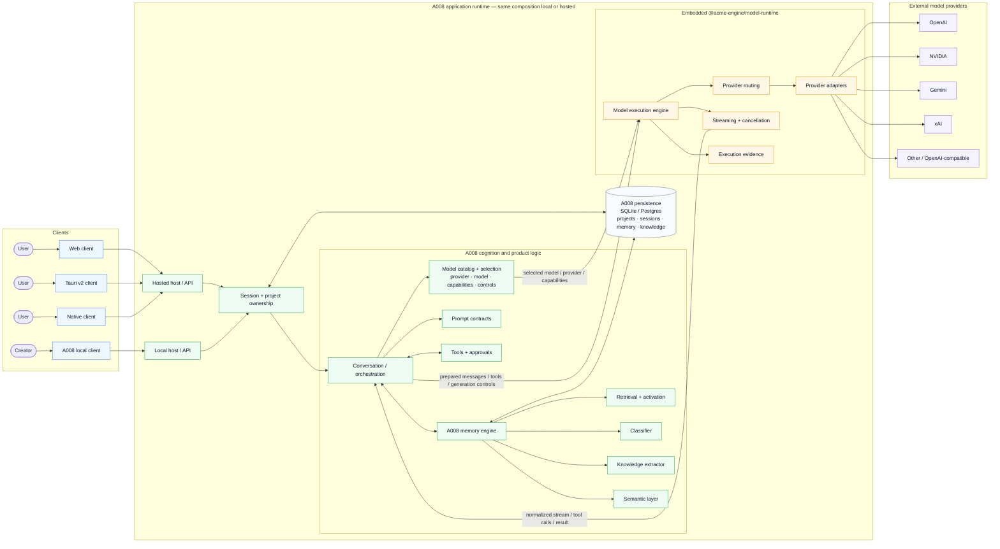

# A008 target system architecture

This document describes the intended A008 system boundary for Step 4 and beyond.

The target is an **A008-owned application runtime** where cognition, memory,
model selection, tools, prompts, project/session ownership and product policy
remain inside A008. ACME is embedded **in-process** through
`@acme-engine/model-runtime` and owns model execution mechanics only.

The same logical composition can be deployed locally or hosted. A remote ACME
sidecar remains a possible deployment option, but it is not the default target.



## Ownership boundary

A008 owns:

- application and session/project semantics
- memory, retrieval, extraction, classification and semantic knowledge
- prompts and tool policy
- model catalog, model selection and provider strategy
- product-level fallback or retry policy between models
- durable application state

Embedded ACME owns:

- execution of the model request A008 prepared
- exact provider routing for that request
- streaming and cancellation
- execution evidence and model-call normalization
- provider adapters and provider-specific transport behavior

ACME does **not** choose which model A008 should use and does not own A008
memory, cognition, prompts, tools or fallback strategy.

## Deployment rule

The default target is:

```text
client -> A008 -> embedded @acme-engine/model-runtime -> provider
```

not:

```text
client -> A008 -> HTTP -> separate ACME sidecar -> provider
```

A remote ACME runtime can remain available later as an optional deployment
adapter behind the same internal execution boundary.
