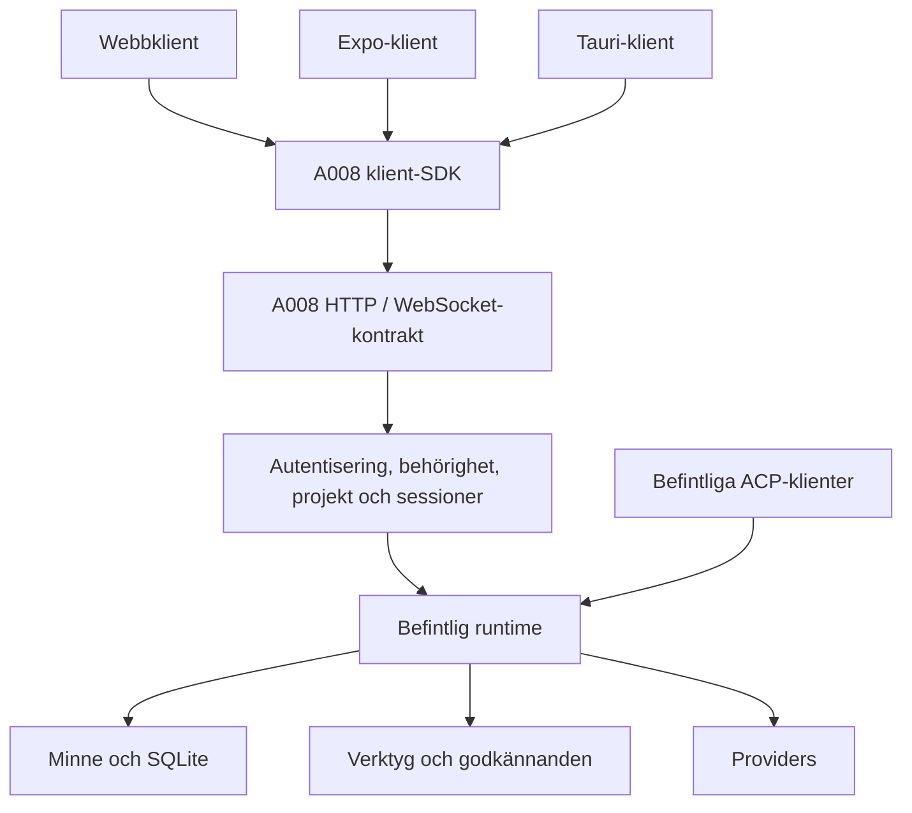

# A008:s stabila API-gräns mot klienter

Status: Accepted and frozen — A008-0103; implementation tracked per child task
Planning task: A008-0102
Date: 2026-09-14
Source revision: bbd4372 (efter integration av A008-0101)
Frozen body SHA-256 (UTF-8 LF, from first heading): 0a7edce0560e781a5dba6ec89be28e7e75f3b0eeeca6a062b72d9e525c3d8f2c
Authority: ADR 0040; owner approved freeze and sequential implementation 2026-09-14.
The body retains its proposal-time wording; the program records activation.

## Rekommenderad riktning

Gör A008:s befintliga HTTP/WebSocket-gräns till ett versionshanterat
produktkontrakt. Runtime, minne, verktyg och providers behåller sina nuvarande
ägare. Webben blir första konsument av ett separat klient-SDK; en liten Expo-klient
bevisar därefter att kontraktet fungerar utan GUI-källkoden.

Med offentlig menas här ett dokumenterat kontrakt för klientutvecklare, även om
klienterna är våra egna. Det innebär inte anonym åtkomst eller en publik molntjänst.
En hård gräns omfattar validering, behörighet, livscykel och kompatibilitet — ett
HTTP-anrop eller delade TypeScript-typer ensamt räcker inte.

Planeringsantagande: en ägare, en A008-server och flera klienttyper/enheter.
Fleranvändartjänst, offline-synk, historik efter serveromstart och PostgreSQL ingår
inte. Mobilen behöver ingen lokal runtime eller direkt databasåtkomst.



Provideradministration och bildjobb som redan ägs av hosten ligger också bakom
API-fasaden. Diagrammet innebär inte att de måste flyttas in i chattsessionen.

## Verifierat nuläge och varför det behöver avgränsas

| Befintligt beteende | Konsekvens för en oberoende klient | Källa |
| --- | --- | --- |
| Dokumenterat `/v1` och WS `/v1/session`, men ingen versionshandshake | Klienten saknar ett tillförlitligt sätt att välja funktioner/version före anslutning | [HOST_PROTOCOL](../HOST_PROTOCOL.md) |
| Serverns wire-typer och klientens parser/typer underhålls separat | Ändringar kan glida isär trots att respektive paket kompilerar | [hostprotokoll](../../src/gui-host/protocol.ts), [GUI-protokoll](../../gui/src/session/protocol.ts) |
| HTTP-fel har två likadana textfält; PIN-recovery matchar en exakt text | UI måste känna till felmeddelanden för att välja åtgärd | [server](../../src/gui-host/server.ts), [engine-access](../../gui/src/session/engine-access.ts) |
| `applyWorkspace` byter gemensamt workspace och stänger ACP-bryggan | En klients projektval kan påverka andra sessioner | [server](../../src/gui-host/server.ts) |
| Engine-läget har redan en runtime per workspace och sessionbundna paneler | Återanvänd befintligt ägarskap när standalone får explicit projektbindning | [engine-host](../../src/engine/engine-host.ts), [ADR 0028](../adr/0028-engine-package-and-panels.md) |
| PIN-cookie och lokal panel-capability är olika åtkomstprofiler; panel-WS använder capability i URL | Native behöver en definierad inloggningsväg; en panel-token är inte ett generellt enhetskonto | [HOST_PROTOCOL](../HOST_PROTOCOL.md), [ENGINE](../ENGINE.md) |
| Kort återanslutning bevarar processens session; socketförlust avbryter pågående arbete | Mobil bakgrundstid, sidomladdning och serveromstart får inte presenteras som samma situation | [ADR 0037](../adr/0037-mobile-websocket-recovery.md) |
| `thought`/`answer` saknar turn-ID och sekvensnummer; snapshots innehåller interna runtimefält och meddelanden utan ID | Klienten behöver implicit ordning och GUI-antaganden för att hantera sena events och ersätta tillstånd | [hostprotokoll](../../src/gui-host/protocol.ts), [SessionSnapshot](../../src/core/session-control.ts) |
| GUI-moduler gör egna HTTP-anrop och hämtar auth från webbläsarmiljön | Ett SDK måste skilja nätverk/session från React, location och lagring | [memory-client](../../gui/src/memory/memory-client.ts), [terminal](../../gui/src/terminal/run-shell-command.ts), [upload](../../gui/src/upload/upload-source.ts) |

## Vad gränsen ska äga

Backend äger kanoniska projekt, sessioner, turer, minnesändringar, verktygsbeslut,
provideranrop och den behörighet som krävs för varje operation. Klienten äger
navigation, presentation, lokalt utkast, tema och användarens uttryckliga val.
Ett SDK kopierar inte runtime-logik och förstärker inte minnen lokalt.

Det ska vara möjligt att byta intern SQLite-modell, ACP-brygga eller runtimeklass
utan att en konsument behöver ändras när det publicerade kontraktet är oförändrat.
Klienter använder publika DTO:er, inte `SessionSnapshot` eller databasmodeller som
råkar finnas i `src/core` och `src/memory`. Minnessynens grundvärde och utvärderade
strength får exponeras som uttryckliga läsfält; klienten räknar inte fram ny kanon.

Föreslagen kodstruktur, utan byte av byggverktyg eller total monorepo-ombyggnad:

```text
packages/protocol/   wire-scheman, DTO:er, felkoder, versioner, fixtures
packages/client/     HTTP/WS, auth-adapter, requesthantering, sessionstillstånd
src/gui-host/       transport, behörighet och adapter till befintliga ägare
src/engine/         befintligt projekt-/runtimeägarskap
gui/                UI som använder klientpaketet
```

Protokollpaketet får inga imports från runtime, Node, databas eller React.
SDK:t får injicerade `fetch`, socket-fabrik och credential-adapter. Webbläsarens
cookie-/location-hantering och native säker lagring ligger i plattformsadaptrar.
CI testar importgränser samt installation av de packade klientpaketen i en
separat minimal konsument; relativ import från A008:s internkod ska då inte gå.

## Föreslaget kontrakt att frysa före beteendeförändringar

### Scheman, version och fel

V1 finns kvar under migreringen. Nya brytande semantiker får `/v2` och ett separat
WS-subprotokoll, exempelvis `a008.v2`. Byt inte innehållet i `/v1` i tysthet.
V2 och namnen nedan är förslag, inte befintliga endpoints.

En enda uppsättning wire-scheman ska äga validering och härledda TypeScript-typer.
Generera HTTP-beskrivningen som [OpenAPI 3.1](https://spec.openapis.org/oas/v3.1.1.html)
och WS-meddelandenas [JSON Schema](https://json-schema.org/draft/2020-12) från samma
ägare; använd inte två handskrivna kontrakt. Dokumentera WS-tillståndsmaskinen och
exempelsekvenser separat, eftersom fältscheman inte anger ordning och ägarskap.
En specifik generator väljs först när befintliga scheman och byggkedjan kartlagts.

Föreslagen `GET /v2/info`: protokollversioner, serverInstanceId, serverversion,
auth-profiler och grundläggande gränser. Behörighetsberoende capabilities returneras
för den autentiserade klienten: exempelvis chat, memory.inspect, upload, terminal,
provider.admin och projects.manage. Saknad capability är ett tydligt unsupported-
utfall. Capabilities ersätter aldrig backendens behörighetskontroll.

Fel har en stabil `code`, läsbar `message`, korrelations-ID och relevanta
project/session/operation-ID:n. HTTP-status och kod dokumenteras tillsammans:
`UNAUTHENTICATED`, `FORBIDDEN`, `PROJECT_NOT_FOUND`, `SESSION_EXPIRED`,
`SESSION_BUSY`, `REVISION_CONFLICT`, `UNSUPPORTED_CAPABILITY` och `INVALID_REQUEST`.
Timeout/transportavbrott kan betyda okänt operationsutfall, inte säker misslyckad
exekvering. SDK:t får aldrig återköra en skrivning bara för att felet är tillfälligt.

Behåll v1:s tolerans för okända tillägg. V2 tillåter dokumenterade extra svarsfält
och ignorerbara informational events; okända kommandon avvisas. Nya obligatoriska
fält, ändrad fältbetydelse och nya nödvändiga kontrollflöden kräver version eller
uttrycklig capabilityförhandling. Lägg fält-/bytegränser på alla inkommande payloads.

### Projekt, session och tur är separata identiteter

Alla projektbundna operationer måste kunna härledas till exakt ett auktoriserat
projekt, direkt via projectId eller via en verifierad session. En session binds
vid skapandet till ett projekt; UI:s projektval ändrar inte en global runtime.
Sökvägar är hostens implementerings-/administrationsdata, inte mobilklientens
identitetsformat. Backendens register mappar projectId till verkligt workspace.

Återanvänd eller extrahera befintligt runtimeägarskap från engine-läget. Starta
inte två ägare för samma minneskatalog när standalone och paneler möts. V1:s
globala projektbyte får endast påverka dess egen kompatibilitetsyta under övergången.
Att öppna projekt B i klient B får inte stänga klient A:s session i projekt A.

Kartlägg dessutom befintliga standalone-projekts ID:n, minnesfiler och source-store
innan bindningen ändras. Använd engine-lägets uttryckliga legacy-attachment där det
passar och avvisa motstridiga ägare. Ett gammalt projekt får inte tyst få en ny tom
minnesdatabas; filflytt/kopiering kräver en separat verifierad migreringsplan.

Separera connectionId, sessionId och turnId. En session kan vara detached utan
att vara closed. En explicit close är en backendoperation; att ta bort en lokal
SDK-instans betyder disconnect. Begränsa initialt till en aktiv skrivande klient
och en aktiv tur per session; en andra anslutning får ett begripligt konfliktsvar.
Samtidiga olika sessioner/projekt är en annan sak och ska testas separat.

### Streaming, återanslutning och dubbla kommandon

Events bär sessionId, turnId när tillämpligt och ett monotont sequence inom
serverInstanceId/session. Ett session-snapshot anger vilken sekvens det representerar.
Klienten kan därmed kasta gamla events och ersätta tillstånd utan dubbla meddelanden.
Snapshot och prenumeration måste ha en definierad gräns så events inte tappas i
glappet mellan att läsa tillstånd och börja lyssna.
Committed messages får stabila messageId:n och en dokumenterad ordning; klientens
optimistiska utkast kopplas till kommando/turn i stället för till arrayposition.

Definiera separata utfall för mottaget kommando, accepterad tur och turens terminala
utfall: completed, cancelled, interrupted eller failed. Endast completed är
bekräftad färdig behandling enligt runtimekontraktet. Cancellation kan inte lova
att ett redan utfört verktygsbiverkan återställs. Tankeström förblir transient och
ska inte hamna i durable history, minne eller en allmän replaylogg.
Det terminala resultatet skiljer också färdigt chatsvar från utfallet av den
efterföljande minnesbehandlingen. Delvis misslyckad minnessparning får inte döljas
som att allt sparats, och ett retry får inte köra om hela modellsvaret av misstag.

För första V2 rekommenderas samma grundpolicy som ADR 0037: transportförlust
avbryter aktivt arbete; en bevarad session kan återanslutas inom serverannonserad
lease, initialt dagens 45 sekunder. Återanslutning hämtar ett auktoritativt snapshot;
förlorad transient ström behöver inte återspelas. Vid lease-expiry, serveromstart
eller saknad session får klienten ett explicit utfall och erbjuder ny session.
Lova inte historik efter serveromstart eller bakgrundskörning på mobilen i denna fas.

Muterande kommandon har ett stabilt kommando-/idempotens-ID skilt från turnId.
Samma ID och innehåll får inte skapa dubbla turer eller verktygsgodkännanden inom
den annonserade process-/retentiongränsen. Samma ID med annat innehåll ger konflikt.
Efter serverInstanceId-byte eller utgången retention får SDK:t inte automatiskt
återköra ett kommando med okänt utfall. Specificera gränserna, undvik ett löfte om
generell exactly-once-exekvering. Bildjobb, bootstrap och upload behöver samma
tydliga retry-policy även om de använder HTTP.

### Auth och verktygsauktoritet

Behåll separata profiler med samma behörighetskontroller: webben kan använda
HttpOnly-cookie, lokala ACP-paneler sin sessionbundna capability och en native
klient en av ägaren registrerad enhetscredential. Nativecredential ska vara
återkallelig och sparas i plattformens säkra lagring; en levererad app får inga
inbakade server-, Cloudflare- eller providerhemligheter. Ägarstyrd registrering/
pairing och credentiallivslängd måste beslutas i auth-slicen, inte improviseras i UI.

För V2-WS föreslås en kortlivad engångsbiljett från ett autentiserat HTTP-anrop,
skickad i en första auth-frame. Biljetten binds till rätt principal/session/scope.
Hosten tar inga verksamhetskommandon före verifiering och begränsar pre-auth tid,
antal sockets och frame-storlek. Behåll Origin-kontroll för webbläsare och lägg
inga långlivade credentials i URL eller loggar. Standardwebbläsarens
[WebSocket-konstruktor](https://developer.mozilla.org/en-US/docs/Web/API/WebSocket/WebSocket)
har inte ett generellt argument för egna HTTP-headers; SDK:t ska därför inte anta
att en Authorization-header fungerar likadant på alla klientplattformar.

Cloudflare/annan reverse proxy är ytterligare ett lager. Native proof ska använda
den faktiska externa adressen och verifiera dess inloggningsväg utan att öppna
bakdörr runt edge-skyddet. Browser-cookie, enhetsauth och providercredentials är
tre skilda saker. PIN-textmatchningen stannar i v1-adaptern; V2 ger auth-felkoder.

Tool approvals binds till principal, session, tur och engångs-permissionId och
avgörs på backend. Ett gammalt eller återkallat godkännande får inte köra verktyget.
Reconnect återställer inte Allow all. Terminaloperationer och hostens katalog-
bläddring kräver uttryckliga rättigheter; modelltext kan inte ge dem. Begränsa
provideradministration till rätt capability och returnera aldrig nyckelvärden.

### Behåll transportvalen; gör alla operationers ägare explicita

| Yta i V2 | Föreslagen transport och kontext |
| --- | --- |
| Discovery, authprofil, tillåtna projekt, modellmetadata | HTTP; principal och capabilities |
| Create/attach/close, prompt, cancel, controls och permissions | Befintlig WS-kommandoprincip, med explicit projekt/session/tur |
| Session-snapshot och operationsstatus | HTTP eller WS-läsning över samma backendägare, en dokumenterad snapshotgräns |
| Minnesinspektion och source upload | HTTP med explicit projekt/session; samma runtimeägare för ingest |
| Runtimeinställningar | Befintlig ägare och optimistic revision; tydlig global respektive session scope |
| Terminal, project browse/bootstrap, provideradmin och bildjobb | Separata HTTP-operationer med uttrycklig capability, kontext och retry-policy |

Inventera alla nuvarande routes, även browser/frame-check och providerkatalogernas
administration. Varje route blir publikt stöd, en dokumenterad valfri capability
eller en v1-/lokal specialfunktion. Ingen befintlig stödd GUI-funktion försvinner
bara för att en första Expo-skärm inte använder den. Uploads skiljer lagrade bytes,
lyckad extraktion och lyckad ingest; råbyteskvittens är inte bekräftat minnesinnehåll.

## Genomförande i avgränsade steg

Stegen är föreslagna arbetsvågor, inte redan tilldelade A008-task-ID:n. Operatören
fryser ett konkret charter åt gången enligt TASK_WORKFLOW. Nya garantier kräver
ett accepterat ADR som ändrar berörda delar av ADR 0019/0028/0029/0037.

| Steg | Leverans | Beroende | Klart när |
| --- | --- | --- | --- |
| 1. Lås dagens kontrakt | Full route/frame-inventering, gemensamma v1-scheman, fixtures och adaptergränser; föreslaget V2-ADR | Nuvarande main | Befintlig webb och ACP-panel fungerar oförändrat; verkliga requests/svar valideras; inga dubblerade handskrivna wire-typer |
| 2. Skilj projekt/session från anslutning | Runtime-/sessionfasad med explicit bindning; v1-kompatibilitetsadapter | Steg 1 + accepterat ägarskapsbeslut | Två klienter i olika projekt påverkar inte varandra; close/reset/undo träffar bara avsedd session; en minnesägare per katalog |
| 3. Inför V2-kontrakt och auth | Discovery, scheman/DTO:er, felkoder, device/browser/panel-profiler, capabilitykontroller | Steg 2 + accepterat V2/auth-ADR | Fel version och fel behörighet ger tydligt utfall; HTTP och WS har samma auktoritet; nycklar/tokens läcker inte |
| 4. Gör tur-/recoverybeteendet verifierbart | Turn-ID, sekvens/snapshotgräns, terminala utfall och begränsad idempotens | Steg 3 | Tappad anslutning, sen delta, dubbelt kommando, expired lease, serverrestart och gammalt approval ger rätt slutläge utan dubbel exekvering |
| 5. Bygg SDK och migrera webben | Plattformsoavhängigt client-paket; React-adapter; hela befintliga GUI:t går genom kontraktet | Steg 3–4 | Ren konsument kan installera paketet; GUI har inga egna wire-parsers eller runtimeimports; cookie/native-adaptrar testas separat |
| 6. Bevisa klientgränsen | Liten separat Expo-klient: anslut, välj projekt, chatta/avbryt, godkänn verktyg, inspektera minne | Steg 5 | Fungerar mot lokal och verklig extern host; bakgrund/återkomst visas korrekt; ingen kopierad GUI-/runtimekod behövs |
| 7. Frys första klientreleasen | Versionsmatris, kompatibilitetsjobb, changelog, kontraktdokumentation och avvecklingsvillkor för v1 | Steg 6 | Fryst första klient fungerar mot nästa backend med samma major; v1 tas bort först när kända konsumenter migrerats |

Steg 1 är lämplig nästa implementation: kartlägg hela nuvarande ytan och samla
kontraktet utan beteendebyte. Första native-proof ska vara liten; fullt Expo-UI
och Tauri-paketering påbörjas efter att gränsen har bevisats.

## Acceptansmatris för en hård gräns

- Kör kontraktstester mot en riktig hostprocess med fake provider och temporära
  projekt; mockade fetch-svar ensamma bevisar inte rätt projekt-/sessionägare.
- Testa minst: olika projekt samtidigt, fel projekt/session-kombination, stale
  settings revision, duplicerat startkommando, cancel under approval, reconnect
  under stream, sent gammalt event, återkallad credential, lease-expiry och restart.
- Testa att minnesinspektion och lifecycle-evaluation är read-only samt att ingest
  fortfarande har rätt provenance och går genom samma kunskapsmotor.
- Kör den befintliga offline-sviten och installations-/bundleprov för ACP-panelen.
  Den äldre klientens kontraktsfixtures måste gå mot den nya backendversionen.
- Paketera SDK/protocol och bygg en separat konsument utan GUI-källkod. Inför
  importkontroll som förbjuder konsumentimports av runtime och databas.
- Validera bytes på nätverksgränsen och korrelation/tillståndsövergångar. Kontrollera
  att ändrade kontrakt inte kräver textmatchning av mänskliga felmeddelanden.
- Verifiera origin/cookie/WS-auth och faktisk reverse proxy i browser/native-proof.
  Provideranrop ersätts av fake transport tills en separat live-gate är auktoriserad.

Gränsen är godkänd när en utvecklare kan bygga en fungerande klient utifrån
kontraktsdokument, SDK och fixtures, utan att läsa eller kopiera `gui/` eller
`src/memory/`, och en intern runtime-refaktor inte bryter den klienten.

## Beslut och senare arbete

Rekommenderad första målbild är en ägare, en backend, flera klienttyper och
explicit processlokala sessioner. Detta är tillräckligt för att frysa en användbar
gräns och bevisa Expo-stödet. Innan respektive implementation aktiveras ska dess
ADR uttryckligen besluta enhetsregistrering, sessionens lease/attach-policy,
snapshot/idempotensgränser och v1-kompatibilitet.

Om mobilappen ska fortsätta långa körningar i bakgrunden, öppna samma historik
efter dagar eller låta flera enheter samtidigt styra samma session behövs separata
beslut om durable sessions, körningsägare, återanslutning och godkännanden. Lägg
inte in dessa löften dolt i en reconnect-funktion. PostgreSQL och Supabase blir
ett separat lagrings-/driftbeslut när konkreta serverkrav motiverar dem; de är
inte en förutsättning för detta API-arbete.
