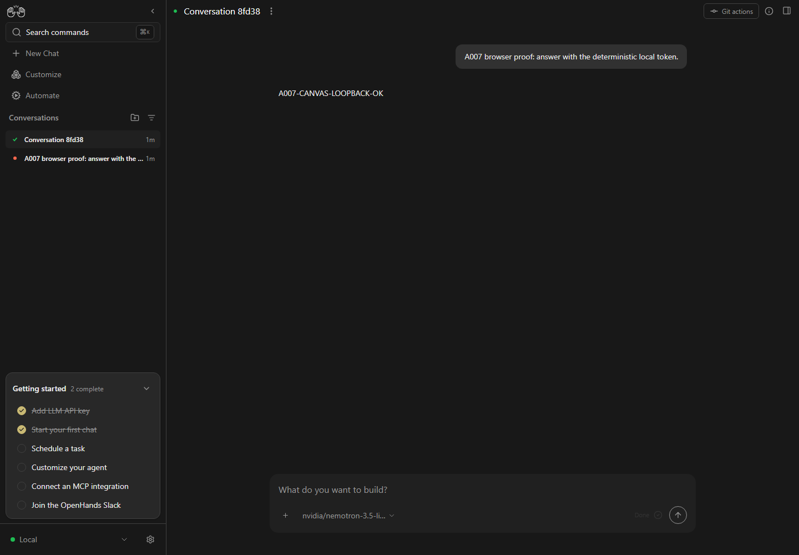

# A007-0005 Agent Canvas runtime proof

Task: A007-0005

Date: 2026-09-01

Evidence boundary: local fake-provider runtime; no live model inference

## Result

OpenHands Agent Canvas 1.16.0 visibly completed one conversation through
OpenHands Agent Server 1.44.1, the compiled a007 stable-v1 ACP process, the
existing a007 NVIDIA adapter, and a loopback fake chat-completions server.

The stable browser capture shows both the user prompt and the deterministic
answer `A007-CANVAS-LOOPBACK-OK` after Agent Server reported the conversation
`execution_status` as `finished`:

## Observed chain

1. Canvas saved the active `default` Agent profile as `agent_kind: acp` with
   `node C:/code/a007-workers/A007-0005_agent-canvas-runtime-proof/dist/src/acp/server.js`.
2. Canvas created conversation `8fd38dd7-9b82-4f88-8521-8cf54974161a` and sent
   `A007 browser proof: answer with the deterministic local token.`
3. Agent Server initialized a007 0.0.0 over ACP, selected
   `nvidia/nemotron-3.5-lightning-30b-a3b`, and retained the ACP session ID in
   the conversation state.
4. The loopback fixture at `127.0.0.1:18999/v1/chat/completions` received one
   authorized POST with two messages, the verified model, and the exact user
   prompt. It returned deterministic SSE reasoning and answer chunks.
5. Canvas rendered the user message and reply token. The final browser check
   found no error banner, no framework overlay, no page error, and no visible
   Running state.

## Verification facts

- A007: clean `npm ci`, strict typecheck, build, and 38/38 Node tests passed.
  Two new cases cover the loopback fixture's deterministic SSE and rejection of
  an incorrect test key.
- OpenHands: `npm ci` installed 1,394 packages; `npm run build` completed both
  client and SPA/server stages. The checkout remained clean at
  `744e8652f254613045b779eb148bf4f741177975`.
- Initial Canvas browser check: title `OpenHands`, non-empty body, 27
  interactive elements, no error overlay, zero console errors, and zero page
  errors.
- Completed turn: six persisted events across conversation-state, system-
  prompt, and message kinds; `execution_status: finished`; expected a007 model
  and ACP agent state present.
- Cleanup: the Vite, Agent Server, and fake-provider processes were stopped;
  ports 3015, 18115, 18116, and 18999 were no longer listening.

## Windows/runtime findings

- The OpenHands `dev:minimal` launcher timed out after 30 seconds on three cold
  and warm attempts. The pinned Agent Server needed about 42 seconds to become
  ready on this host. Running the same locked `uvx` command and Vite frontend as
  separate processes succeeded without modifying OpenHands.
- A Custom ACP command entered with Windows backslashes was shell-parsed into an
  invalid `C:code...` path. Forward slashes in `C:/code/...` are required in the
  Canvas command field on this observed Windows path.
- Agent Server continued after its optional VSCode service was absent and its
  browser-tool preload raised an MCP compatibility error. Neither service
  participated in the ACP chat proof.
- `dev:minimal` intentionally has no automation backend. Canvas consequently
  logged expected 404s for automation endpoints and a Windows `/projects`
  subdirectory probe returned 400. The completed chat had no UI error banner.
- `npm ci` reported five dependency audit findings (two moderate, three high)
  and an engine warning because jsdom's declared Node 24 floor is 24.15.0 while
  the host is 24.14.1. The application build still passed; no lockfile or
  dependency was changed.

## Security and negative evidence

- `.env.local` was not read. The real replacement NVIDIA credential was not
  validated, displayed, exported, or used. The ACP process inherited only a
  fixed test key and a loopback-only endpoint.
- No live model inference or paid usage occurred. The successful a007 provider
  turn reached only the loopback fixture.
- OpenHands did make ancillary OpenAI subscription device-auth/status requests
  and attempted title generation without credentials around the failed first
  conversation. Title generation failed before inference, and no OpenAI or
  NVIDIA credential was present. This means the run is fake-only for model
  inference, but it is not evidence of fully blocked third-party control-plane
  egress. A later hermetic-runtime task must suppress or filter those optional
  OpenHands paths before claiming zero external egress.
- The first conversation failed before ACP initialization because of the
  backslash command defect. It neither reached the loopback server nor any live
  a007 provider endpoint; the corrected forward-slash command produced the
  completed proof above.
- No OpenHands source file, a007 `.env.local`, raw legacy file, memory engine,
  tool, permission flow, MCP server, automation service, desktop package,
  deployment, publication, or release participated.
